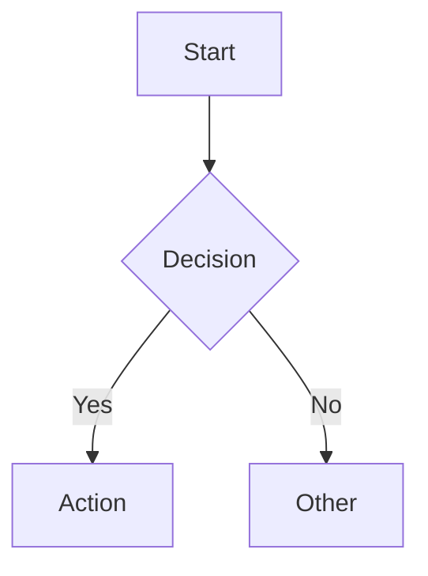

# Mermaid Diagram Templates - Index

This directory contains curated, tested templates for all 14+ Mermaid diagram types.

## Template Categories

### Structural Diagrams
| Diagram | Directory | Description |
|---------|-----------|-------------|
| **Flowchart** | `flowchart/` | Process flows, decision trees, user flows |
| **Sequence** | `sequenceDiagram/` | API flows, async communication, lifecycles |
| **Class** | `classDiagram/` | Domain models, design patterns, architectures |
| **State** | `stateDiagram/` | Order states, user sessions, workflows |
| **Component** | `componentDiagram/` | Microservices, clean architecture, plugins |
| **Package** | `packageDiagram/` | Code organization, bounded contexts |
| **Object** | `objectDiagram/` | Runtime snapshots, pattern instances |
| **Use Case** | `useCaseDiagram/` | System actors, functional requirements |
| **C4** | `c4/` | Context, Container, Component, Code levels |

### Behavioral & Specialized
| Diagram | Directory | Description |
|---------|-----------|-------------|
| **Gantt** | `gantt/` | Project timelines, sprint planning, roadmaps |
| **Git Graph** | `gitGraph/` | Branching strategies, GitFlow, releases |
| **ER** | `erDiagram/` | Database schemas, data models |
| **Journey** | `journey/` | Customer journeys, onboarding, support |
| **Mindmap** | `mindmap/` | Brainstorming, architecture, planning |
| **Kanban** | `kanban/` | Team boards, sprint tracking, portfolio |
| **Quadrant** | `quadrantChart/` | Prioritization, risk, BCG matrix |
| **Requirement** | `requirementDiagram/` | Traceability, V-model, safety |
| **Pie** | `pie/` | Market share, budgets, distributions |
| **Timeline** | `timeline/` | Roadmaps, release history, incidents |

### Architecture & Service Design
| Diagram | Directory | Description |
|---------|-----------|-------------|
| **Architecture Beta** | `architecture-beta/` | Cloud, microservices, serverless, hybrid |
| **Service Design** | `service-design/` | Blueprints, journeys, ecosystems, MOTs |

## Usage

### In Obsidian
```markdown

```

### In Mermaid Live Editor
1. Open https://mermaid.live
2. Copy template content
3. Edit and preview instantly

### Validation
```bash
# Validate syntax
python ../mermaid-syntax-validator/validate.py templates/flowchart/basic.md
```

### Rendering
```bash
# Render to PNG/SVG
python ../mermaid-renderer/render.py templates/flowchart/basic.md -o output.png
```

## Template Structure

Each template file contains:
- Multiple variants (basic, advanced, styled, real-world)
- Inline documentation
- Best practices
- Common variations

## Contributing

1. Add new template to appropriate directory
2. Follow naming: `{variant}.md` (e.g., `with-subgraphs.md`)
3. Include multiple examples per file
4. Test with validator before committing
5. Add to this index

## Quality Checklist

- [ ] Validates with `mermaid-syntax-validator`
- [ ] Renders correctly in Mermaid Live Editor
- [ ] Uses consistent ID naming (camelCase)
- [ ] Includes classDef styles for complex diagrams
- [ ] Documents key syntax in comments
- [ ] Provides 3+ variants per diagram type

## Service Design Templates (Palvelumuotoilu)

Special templates for service design work:
- **Service Blueprint** - Frontstage/backstage/support processes
- **Customer Journey Map** - Emotions, touchpoints, MOTs
- **Service Ecosystem** - Partners, providers, internal systems
- **Touchpoint Analysis** - Quadrant charts for prioritization
- **Moments of Truth** - Critical interaction points

See `service-design/basic.md` for all service design templates.