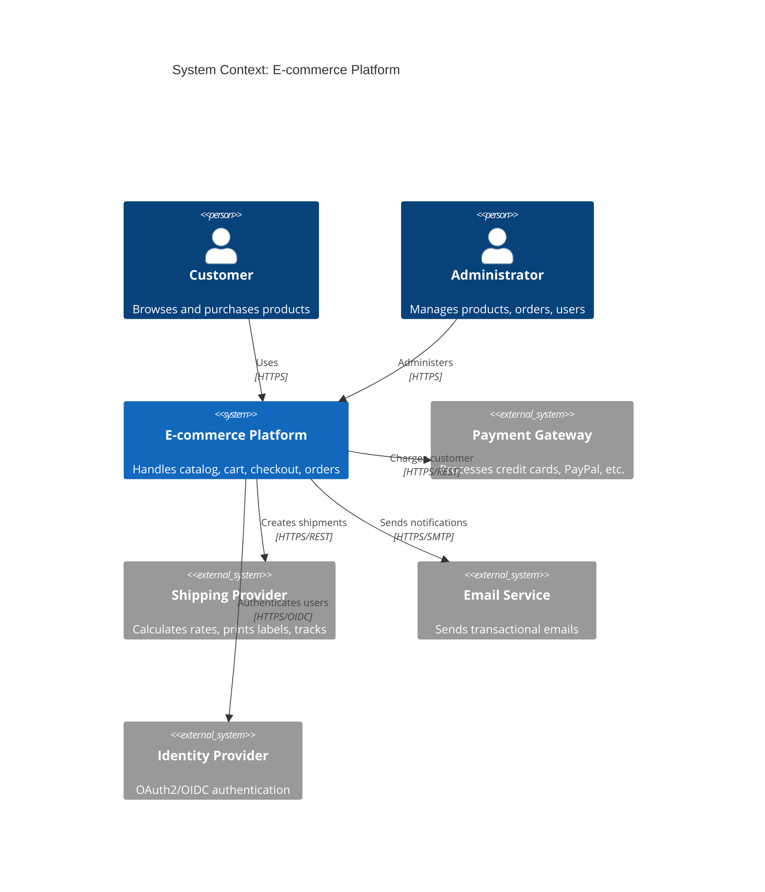
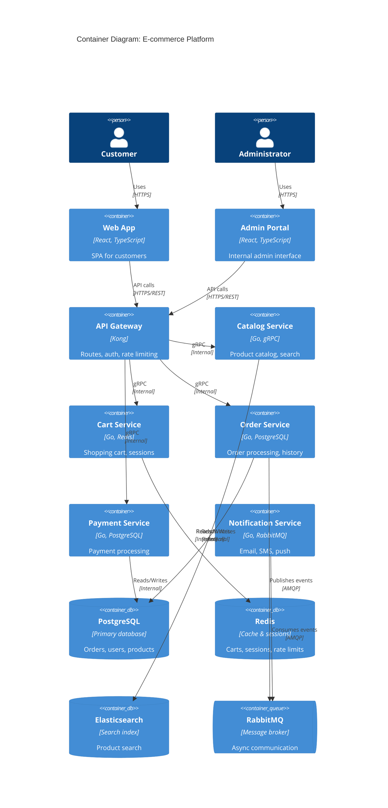

# C4 Architecture Templates

## 1. Context Diagram (Level 1)


## 2. Container Diagram (Level 2)


## 3. Component Diagram (Level 3) - Order Service
```mermaid
C4Component
    title Component Diagram: Order Service
    
    Container(order, "Order Service", "Go, PostgreSQL", "Order processing")
    ContainerDb(postgres, "PostgreSQL", "Orders, items, customers")
    ContainerQueue(rabbitmq, "RabbitMQ", "Events")
    ContainerExt(payment, "Payment Service", "Payment processing")
    ContainerExt(inventory, "Inventory Service", "Stock management")
    
    Component(handler, "HTTP Handler", "Go", "REST endpoints")
    Component(validator, "Request Validator", "Go", "Input validation")
    Component(service, "Order Service", "Go", "Business logic")
    Component(repo, "Order Repository", "Go", "Data access")
    Component(publisher, "Event Publisher", "Go", "Publishes order events")
    
    Rel(handler, validator, "Validates", "Function call")
    Rel(validator, service, "Calls", "Function call")
    Rel(service, repo, "Persists", "Function call")
    Rel(service, publisher, "Publishes", "Function call")
    Rel(repo, postgres, "SQL", "JDBC")
    Rel(publisher, rabbitmq, "AMQP", "Async")
    Rel(service, payment, "gRPC", "Charge customer")
    Rel(service, inventory, "gRPC", "Reserve stock")
```

## 4. Code Diagram (Level 4) - Order Entity
```mermaid
C4Code
    title Code Diagram: Order Entity
    
    Class(Order, "Order", "entity", "Core domain entity")
    Class(OrderItem, "OrderItem", "entity", "Line item")
    Class(Customer, "Customer", "entity", "Customer reference")
    Class(OrderStatus, "OrderStatus", "enum", "PENDING, CONFIRMED, SHIPPED...")
    Class(Money, "Money", "value_object", "Amount + currency")
    Class(OrderRepository, "OrderRepository", "interface", "Persistence port")
    Class(JpaOrderRepository, "JpaOrderRepository", "class", "JPA implementation")
    Class(OrderService, "OrderService", "class", "Application service")
    Class(CreateOrderCommand, "CreateOrderCommand", "class", "Command DTO")
    Class(OrderCreatedEvent, "OrderCreatedEvent", "class", "Domain event")
    
    Rel(Order, OrderItem, "contains", "1..*")
    Rel(Order, Customer, "placed by", "1")
    Rel(Order, OrderStatus, "has status", "1")
    Rel(Order, Money, "total", "1")
    Rel(OrderRepository, JpaOrderRepository, "implements")
    Rel(OrderService, OrderRepository, "uses")
    Rel(OrderService, CreateOrderCommand, "handles")
    Rel(OrderService, OrderCreatedEvent, "publishes")
```

## 5. Deployment Diagram
```mermaid
C4Container
    title Deployment: Kubernetes on AWS
    
    Node(aws, "AWS Cloud", "Region: eu-central-1") {
        Node(eks, "EKS Cluster", "Kubernetes 1.28") {
            Container(web, "Web App", "React", "Deployment: 3 replicas")
            Container(admin, "Admin Portal", "React", "Deployment: 2 replicas")
            Container(api, "API Gateway", "Kong", "Deployment: 3 replicas")
            Container(catalog, "Catalog Svc", "Go", "Deployment: 3 replicas")
            Container(cart, "Cart Svc", "Go", "Deployment: 3 replicas")
            Container(order, "Order Svc", "Go", "Deployment: 3 replicas")
            Container(payment, "Payment Svc", "Go", "Deployment: 2 replicas")
            Container(notification, "Notification Svc", "Go", "Deployment: 2 replicas")
        }
        Node(rds, "RDS PostgreSQL", "Multi-AZ", "Primary + Standby")
        Node(elasticache, "ElastiCache Redis", "Cluster Mode", "3 shards")
        Node(es, "OpenSearch", "3 data nodes", "Search cluster")
        Node(mq, "Amazon MQ", "RabbitMQ", "Broker cluster")
        Node(s3, "S3", "Static assets", "Web app build")
        Node(cdn, "CloudFront", "CDN", "Global edge")
    }
    Person(user, "User")
    Person(admin_p, "Admin")
    
    Rel(user, cdn, "HTTPS")
    Rel(cdn, s3, "Origin")
    Rel(cdn, api, "API requests")
    Rel(admin_p, admin, "HTTPS")
    Rel(api, catalog, "gRPC")
    Rel(api, cart, "gRPC")
    Rel(api, order, "gRPC")
    Rel(catalog, es, "Search queries")
    Rel(cart, elasticache, "Session data")
    Rel(order, rds, "Orders data")
    Rel(payment, rds, "Payments data")
    Rel(order, mq, "Events")
    Rel(notification, mq, "Events")
```