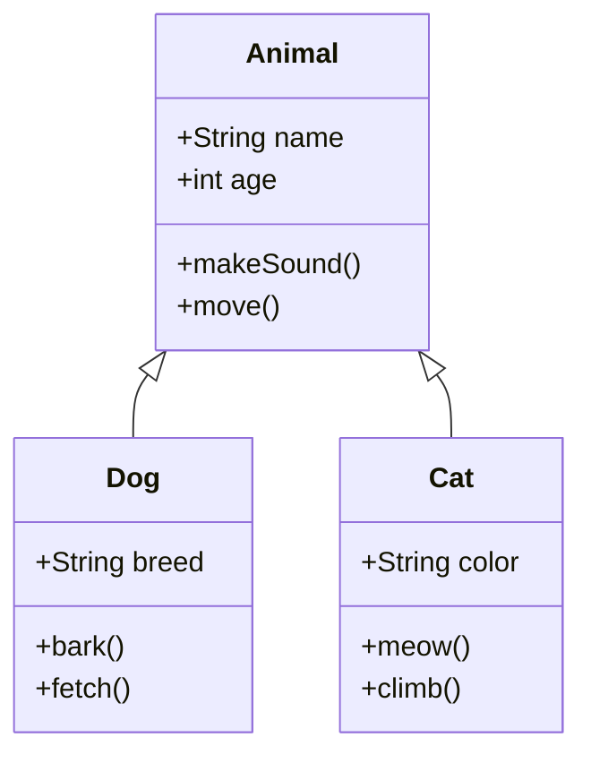
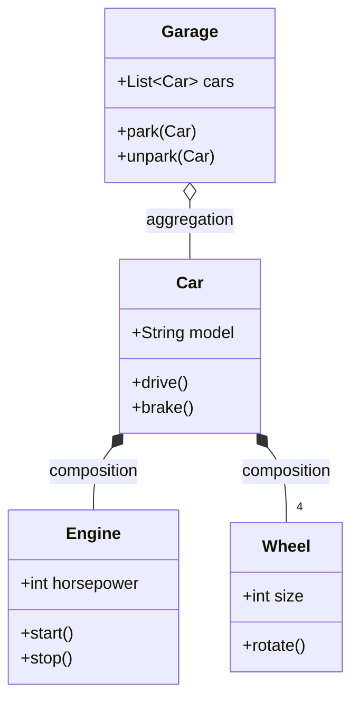
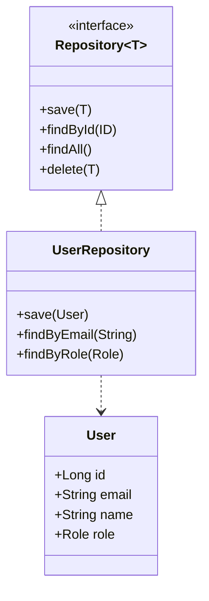
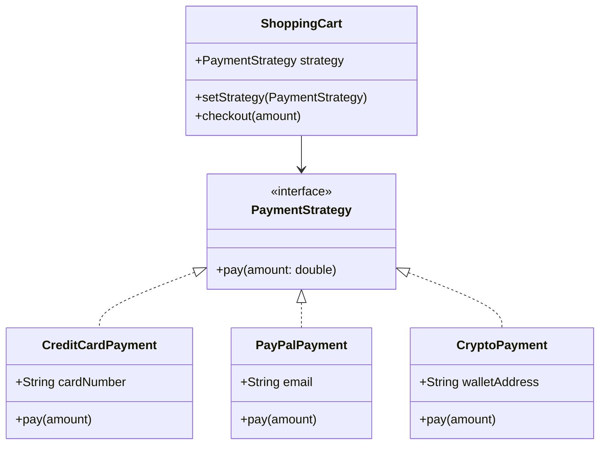
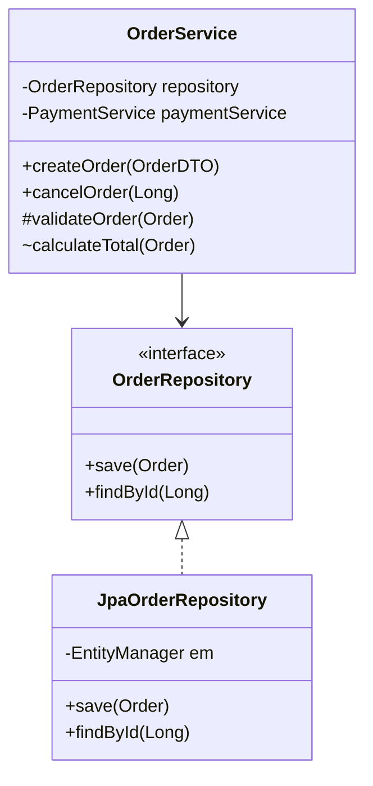
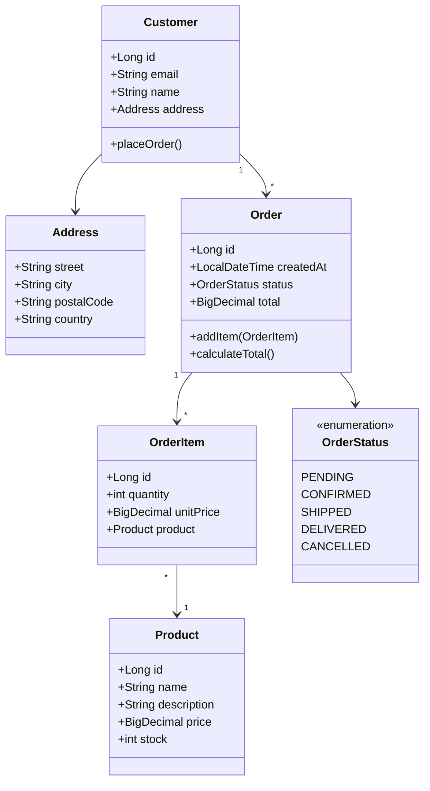

# Class Diagram Templates

## 1. Basic Inheritance

## 2. Composition & Aggregation

## 3. With Interfaces & Generics

## 4. Design Patterns (Strategy)

## 5. With Visibility & Annotations

## 6. Domain Model (E-commerce)
