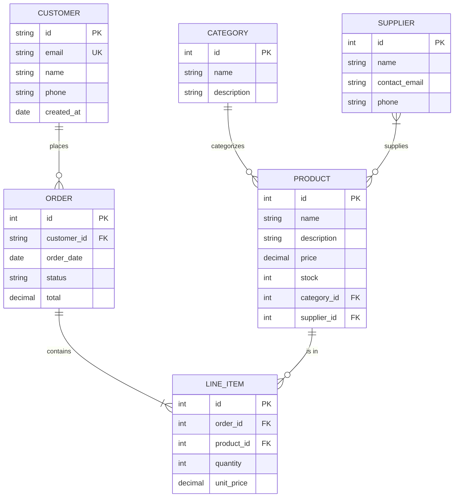
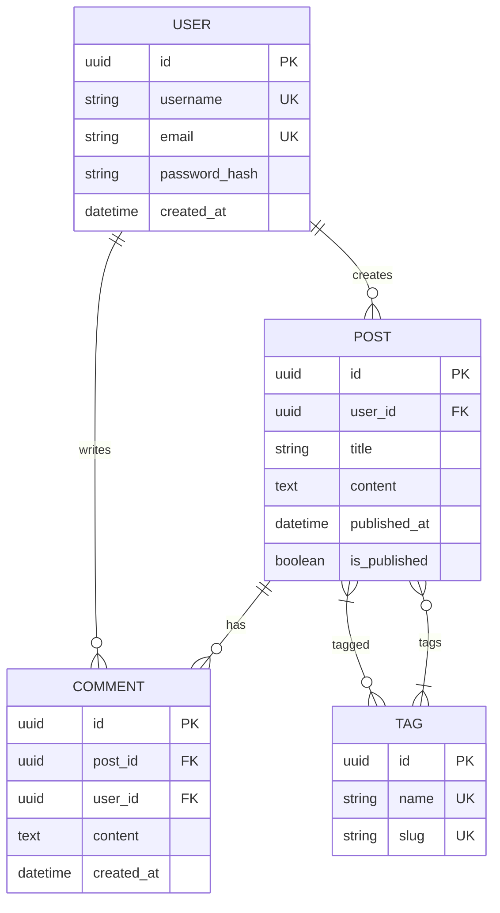
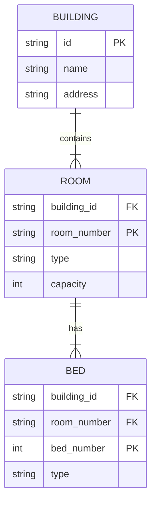
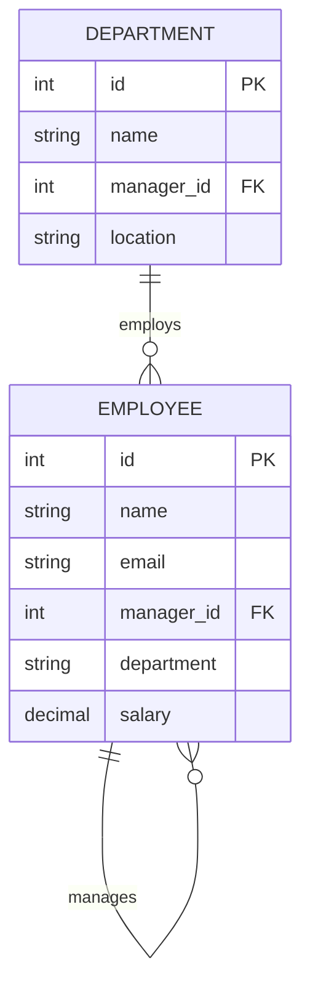
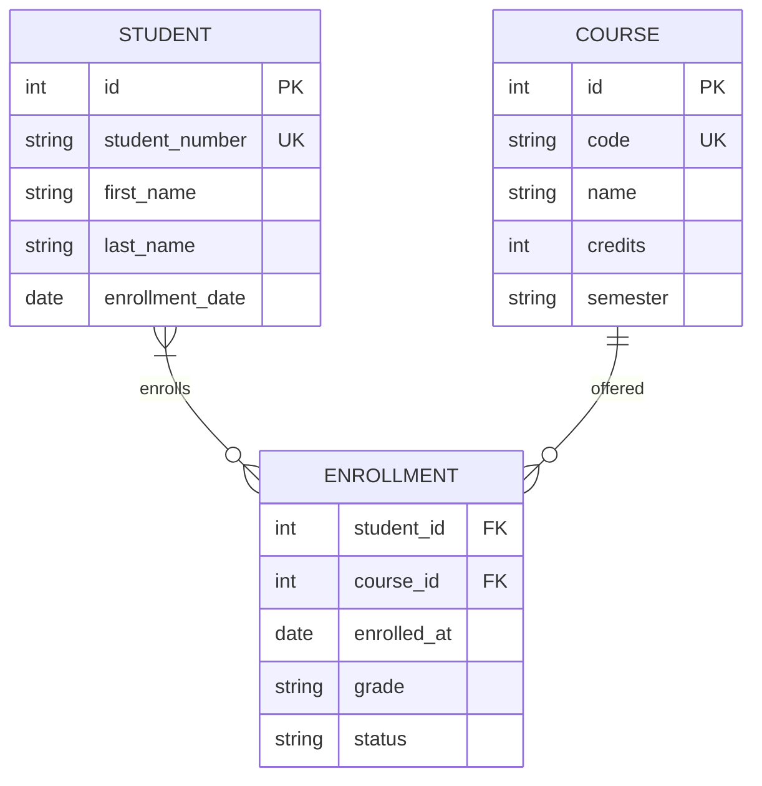
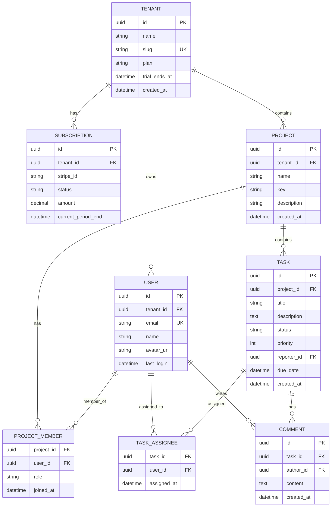

# ER Diagram Templates

## 1. Basic E-commerce (Chen Notation)

## 2. Crow's Foot Notation

## 3. Weak Entity (Identifying Relationship)

## 4. Self-Referencing (Hierarchy)

## 5. Many-to-Many with Attributes

## 6. Complete System (SaaS)
