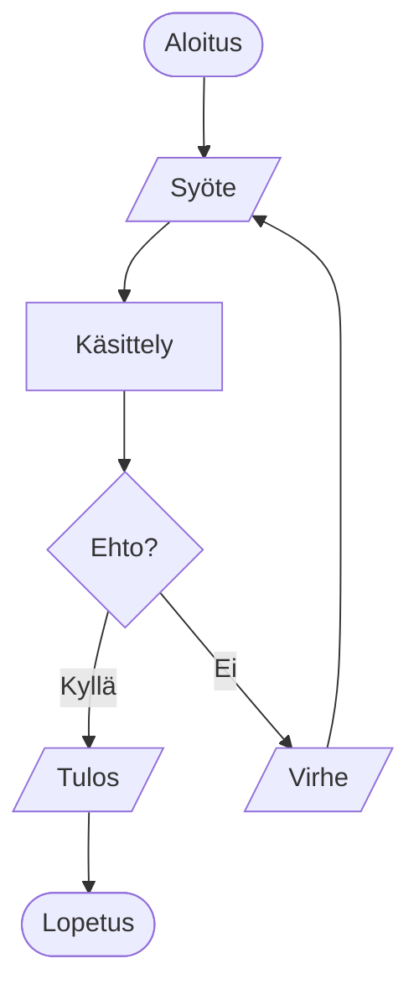
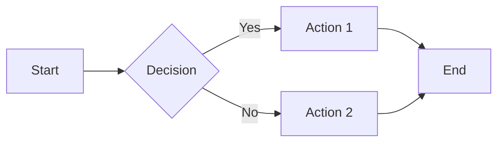
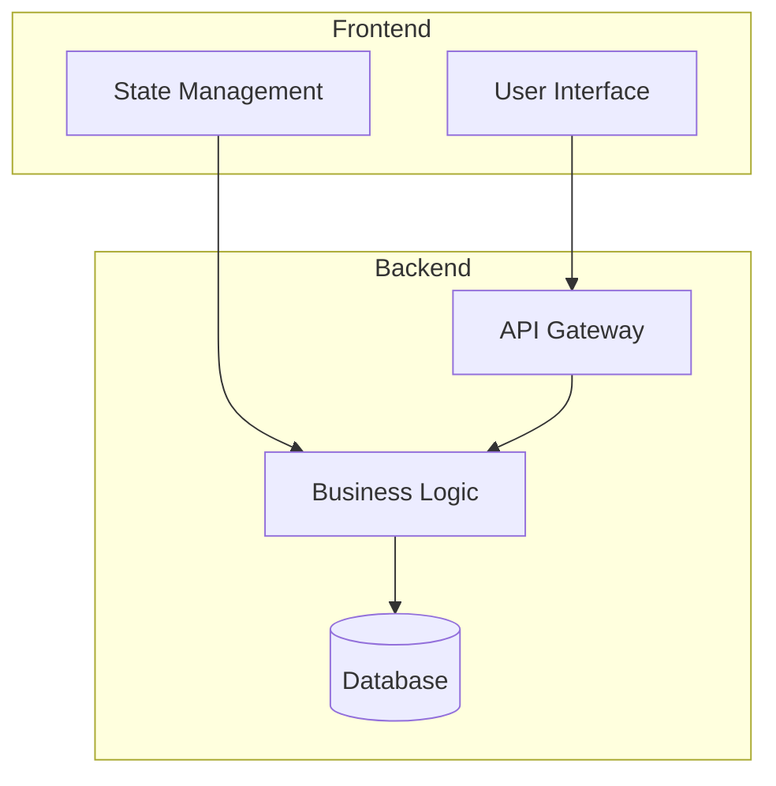
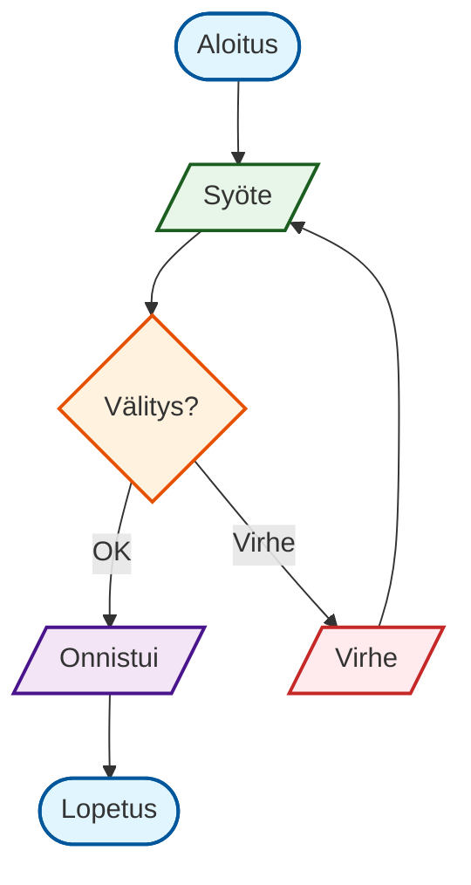
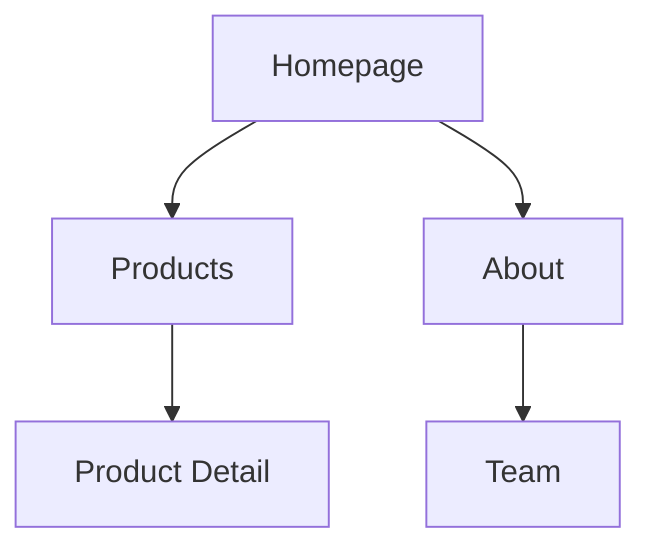
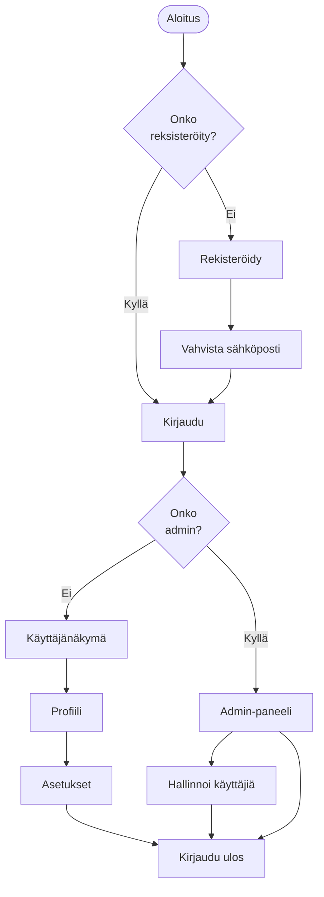

# Flowchart Templates

## 1. Basic Process Flow (TD)

```mermaid
flowchart TD
    Start([Aloitus]) --> Input[/Syöte/]
    Input --> Process[Käsittely]
    Process --> Decision{Ehto?}
    Decision -->|Kyllä| Output[/Tulos/]
    Decision -->|Ei| Error[/Virhe/]
    Error --> Input
    Output --> End([Lopetus])
```

## 2. Horizontal Flow (LR)

```mermaid
flowchart LR
    A[Start] --> B{Decision}
    B -->|Yes| C[Action 1]
    B -->|No| D[Action 2]
    C --> E[End]
    D --> E
```

## 3. With Subgraphs

```mermaid
flowchart TD
    subgraph Frontend
        UI[User Interface]
        State[State Management]
    end
    subgraph Backend
        API[API Gateway]
        Service[Business Logic]
        DB[(Database)]
    end
    UI --> API
    State --> Service
    API --> Service
    Service --> DB
```

## 4. Styled with Classes

```mermaid
flowchart TD
    Start([Aloitus]) --> Input[/Syöte/]
    Input --> Validate{Välitys?}
    Validate -->|OK| Success[/Onnistui/]
    Validate -->|Virhe| Error[/Virhe/]
    Error --> Input
    Success --> End([Lopetus])

    classDef startEnd fill:#e1f5fe,stroke:#01579b,stroke-width:2px;
    classDef process fill:#f3e5f5,stroke:#4a148c,stroke-width:2px;
    classDef decision fill:#fff3e0,stroke:#e65100,stroke-width:2px;
    classDef io fill:#e8f5e9,stroke:#1b5e20,stroke-width:2px;
    classDef error fill:#ffebee,stroke:#c62828,stroke-width:2px;

    class Start,End startEnd;
    class Success process;
    class Validate decision;
    class Input io;
    class Error error;
```

## 5. Clickable Nodes

```mermaid
flowchart TD
    A[Homepage] --> B[Products]
    A --> C[About]
    B --> D[Product Detail]
    C --> E[Team]

    click A "https://example.com" "Go to homepage"
    click B "https://example.com/products" "View products"
    click D callback "Product clicked"
```

## 6. Complex Decision Tree

```mermaid
flowchart TD
    Start([Aloitus]) --> Check{Onko\nreksisteröity?}
    Check -->|Ei| Register[Rekisteröidy]
    Check -->|Kyllä| Login[Kirjaudu]
    Register --> Verify[Vahvista sähköposti]
    Verify --> Login
    Login --> Dashboard{Onko\nadmin?}
    Dashboard -->|Kyllä| AdminPanel[Admin-paneeli]
    Dashboard -->|Ei| UserView[Käyttäjänäkymä]
    AdminPanel --> ManageUsers[Hallinnoi käyttäjiä]
    UserView --> Profile[Profiili]
    Profile --> Settings[Asetukset]
    Settings --> Logout[Kirjaudu ulos]
    ManageUsers --> Logout
    AdminPanel --> Logout
```