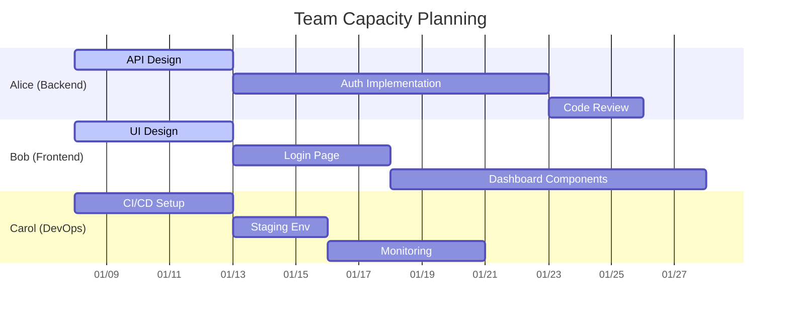
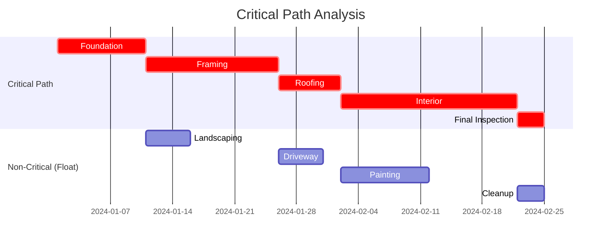

# Gantt Chart Templates

## 1. Simple Project Plan
```mermaid
gantt
    title Project Timeline
    dateFormat  YYYY-MM-DD
    axisFormat  %m/%d
    
    section Planning
    Requirements           :a1, 2024-01-01, 7d
    Design                 :a2, after a1, 5d
    Architecture Review    :milestone, a2, 0d
    
    section Development
    Backend API            :b1, after a2, 14d
    Frontend UI            :b2, after a2, 10d
    Database Migration     :b3, after b1, 3d
    Integration            :b4, after b2 b3, 5d
    
    section Testing
    Unit Tests             :c1, after b1, 7d
    E2E Tests              :c2, after b4, 5d
    UAT                    :c3, after c2, 3d
    
    section Deploy
    Staging Deploy         :d1, after c3, 1d
    Production Deploy      :d2, after d1, 1d
```

## 2. With Resources & Dependencies
```mermaid
gantt
    title Sprint Planning with Resources
    dateFormat  YYYY-MM-DD
    axisFormat  %W
    
    section Sprint 1
    User Stories           :active, s1_1, 2024-01-08, 5d
    Backend: Auth          :active, s1_2, after s1_1, 5d, :dev1
    Frontend: Login        :active, s1_3, after s1_1, 5d, :dev2
    Code Review            :s1_4, after s1_2 s1_3, 2d
    Testing                :s1_5, after s1_4, 2d
    Demo                   :milestone, s1_5, 0d
    
    section Sprint 2
    User Stories           :s2_1, after s1_5, 5d
    Backend: Dashboard     :s2_2, after s2_1, 7d, :dev1
    Frontend: Dashboard    :s2_3, after s2_1, 5d, :dev2
    API Integration        :s2_4, after s2_2 s2_3, 3d
    Code Review            :s2_5, after s2_4, 2d
    Testing                :s2_6, after s2_5, 2d
    Demo                   :milestone, s2_6, 0d
```

## 3. Multi-Project Portfolio
```mermaid
gantt
    title Portfolio View Q1 2024
    dateFormat  YYYY-MM-DD
    axisFormat  %m/%d
    
    section Project Alpha
    Alpha Phase 1          :p1, 2024-01-01, 30d
    Alpha Phase 2          :p2, after p1, 20d
    Alpha Launch           :milestone, p2, 0d
    
    section Project Beta
    Beta Research          :p3, 2024-01-15, 20d
    Beta Development       :p4, after p3, 30d
    Beta Testing           :p5, after p4, 15d
    Beta Launch            :milestone, p5, 0d
    
    section Project Gamma
    Gamma Design           :p6, 2024-02-01, 15d
    Gamma Build            :p7, after p6, 25d
    Gamma Launch           :milestone, p7, 0d
```

## 4. With Custom Styles
```mermaid
gantt
    title Styled Project Plan
    dateFormat  YYYY-MM-DD
    axisFormat  %m/%d
    
    section Phase 1
    Task A                 :crit, a1, 2024-01-01, 5d
    Task B                 :crit, a2, after a1, 5d
    Task C                 :active, a3, after a1, 3d
    
    section Phase 2
    Task D                 :crit, b1, after a2, 5d
    Task E                 :done, b2, after a3, 5d
    Task F                 :b3, after b1, 3d
    
    section Milestones
    M1                     :milestone, a2, 0d
    M2                     :milestone, b1, 0d
    M3                     :milestone, b3, 0d
```

## 5. Resource Allocation View


## 6. Critical Path Highlight
