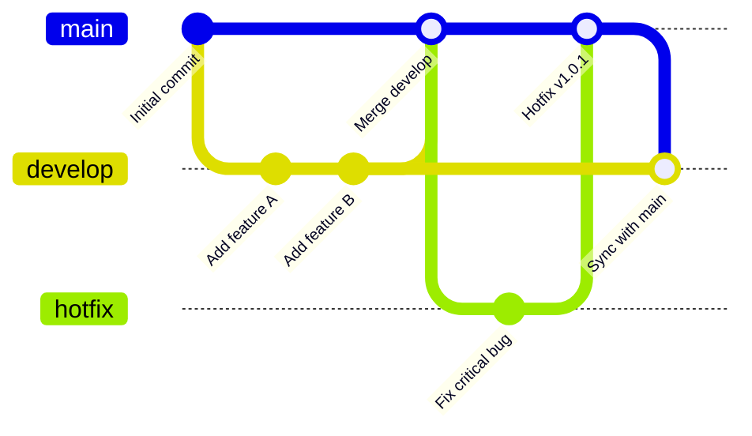
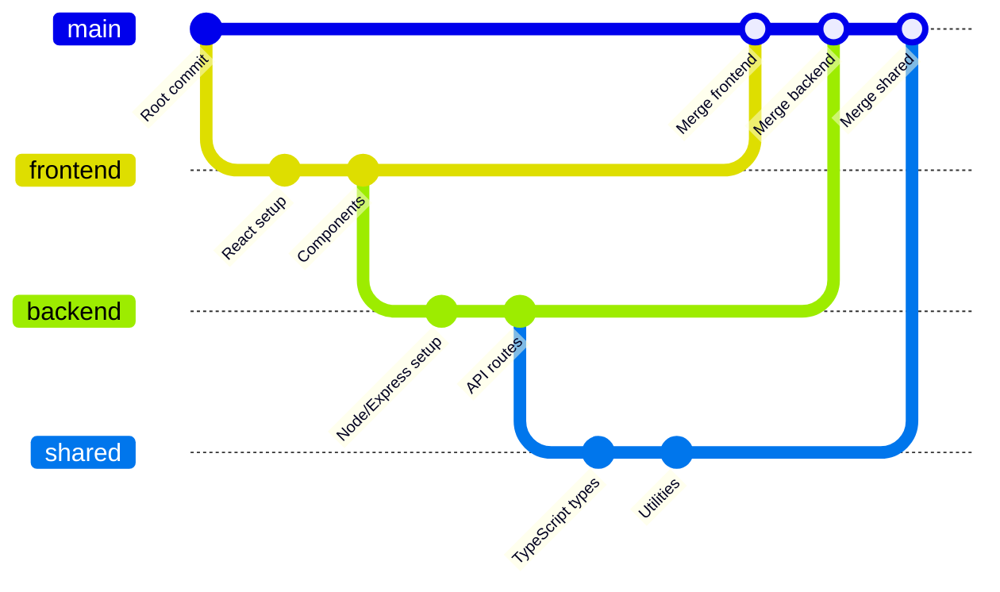

# Git Graph Templates

## 1. Basic Branching

```mermaid
gitGraph
    commit id: "Initial commit"
    branch develop
    checkout develop
    commit id: "Add feature A"
    commit id: "Add feature B"
    checkout main
    merge develop id: "Merge develop"
    branch hotfix
    checkout hotfix
    commit id: "Fix critical bug"
    checkout main
    merge hotfix id: "Hotfix v1.0.1"
    checkout develop
    merge main id: "Sync with main"
```

## 2. Feature Branch Workflow

```mermaid
gitGraph
    commit id: "v1.0.0"
    branch feature/login
    checkout feature/login
    commit id: "Add login form"
    commit id: "Add validation"
    commit id: "Add remember me"
    checkout main
    merge feature/login id: "Merge login feature"
    tag: "v1.1.0"
    
    branch feature/dashboard
    checkout feature/dashboard
    commit id: "Add dashboard layout"
    commit id: "Add charts"
    commit id: "Add filters"
    checkout main
    merge feature/dashboard id: "Merge dashboard"
    tag: "v1.2.0"
```

## 3. GitFlow Model

```mermaid
gitGraph
    commit id: "Initial"
    branch develop
    checkout develop
    commit id: "Dev setup"
    
    branch feature/auth
    checkout feature/auth
    commit id: "OAuth2 integration"
    commit id: "JWT tokens"
    checkout develop
    merge feature/auth id: "Auth feature"
    
    branch feature/api
    checkout feature/api
    commit id: "REST endpoints"
    commit id: "Swagger docs"
    checkout develop
    merge feature/api id: "API feature"
    
    branch release/1.0
    checkout release/1.0
    commit id: "Version bump"
    commit id: "Changelog"
    checkout main
    merge release/1.0 id: "Release 1.0"
    tag: "v1.0.0"
    checkout develop
    merge release/1.0 id: "Back to develop"
    
    branch hotfix/1.0.1
    checkout hotfix/1.0.1
    commit id: "Security patch"
    checkout main
    merge hotfix/1.0.1 id: "Hotfix 1.0.1"
    tag: "v1.0.1"
    checkout develop
    merge hotfix/1.0.1 id: "Hotfix to develop"
```

## 4. With Cherry-Pick

```mermaid
gitGraph
    commit id: "Base"
    branch feature/new-ui
    checkout feature/new-ui
    commit id: "New button styles"
    commit id: "Dark mode support"
    commit id: "Accessibility fixes"
    checkout main
    cherry-pick id: "Accessibility fixes"
    tag: "v2.0.1"
    checkout feature/new-ui
    commit id: "Responsive layout"
```

## 5. Monorepo with Multiple Roots

```mermaid
gitGraph
    commit id: "Root commit"
    branch frontend
    checkout frontend
    commit id: "React setup"
    commit id: "Components"
    
    branch backend
    checkout backend
    commit id: "Node/Express setup"
    commit id: "API routes"
    
    branch shared
    checkout shared
    commit id: "TypeScript types"
    commit id: "Utilities"
    
    checkout main
    merge frontend id: "Merge frontend"
    merge backend id: "Merge backend"
    merge shared id: "Merge shared"
```