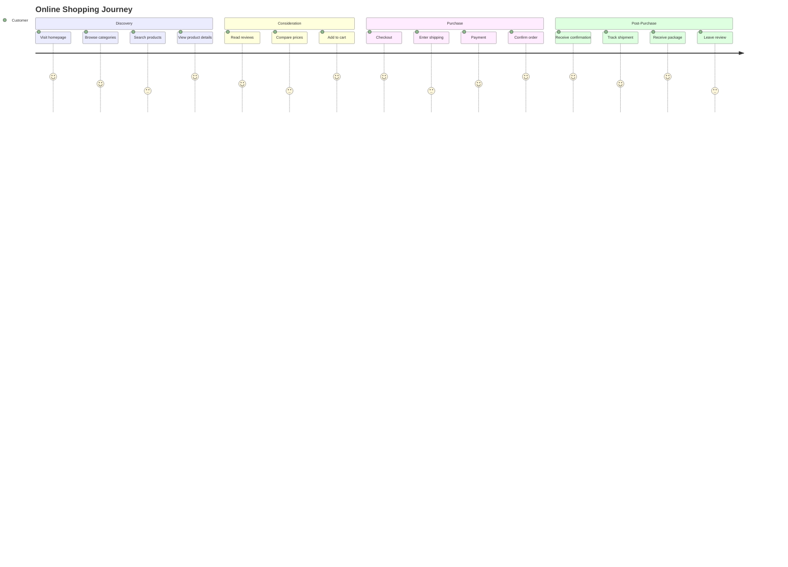
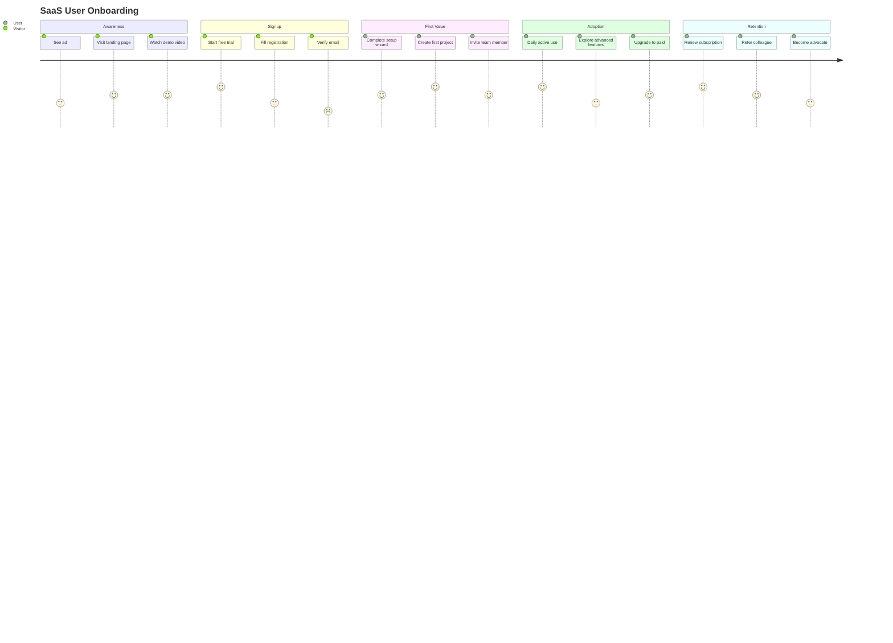
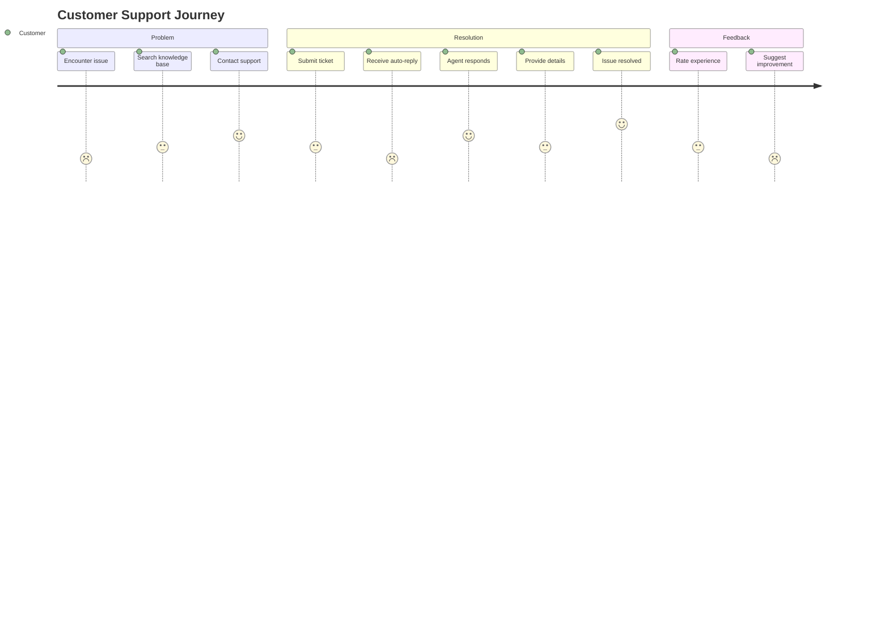
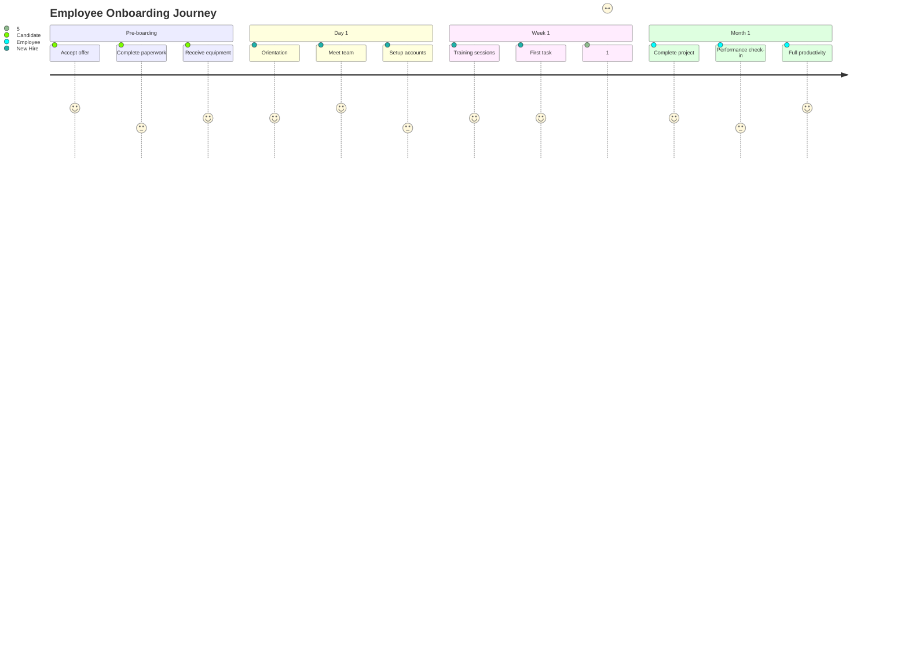
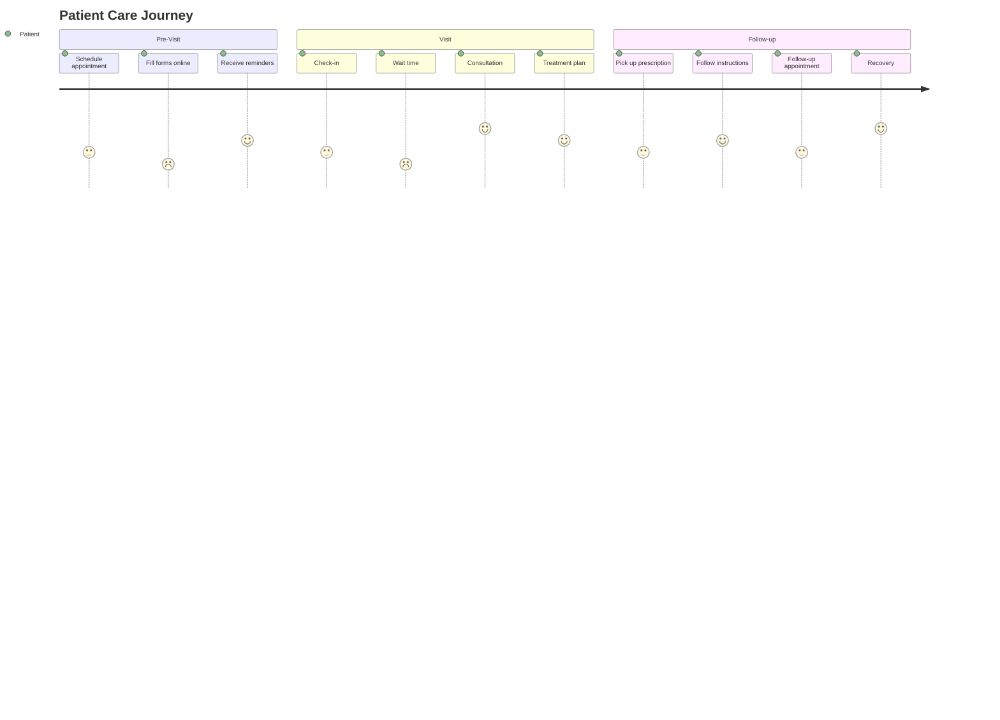

# User Journey Templates

## 1. E-commerce Purchase Journey

```mermaid
journey
    title Online Shopping Journey
    section Discovery
      Visit homepage: 5: Customer
      Browse categories: 4: Customer
      Search products: 3: Customer
      View product details: 5: Customer
    section Consideration
      Read reviews: 4: Customer
      Compare prices: 3: Customer
      Add to cart: 5: Customer
    section Purchase
      Checkout: 5: Customer
      Enter shipping: 3: Customer
      Payment: 4: Customer
      Confirm order: 5: Customer
    section Post-Purchase
      Receive confirmation: 5: Customer
      Track shipment: 4: Customer
      Receive package: 5: Customer
      Leave review: 3: Customer
```

## 2. SaaS Onboarding Journey

```mermaid
journey
    title SaaS User Onboarding
    section Awareness
      See ad: 3: Visitor
      Visit landing page: 4: Visitor
      Watch demo video: 4: Visitor
    section Signup
      Start free trial: 5: Visitor
      Fill registration: 3: Visitor
      Verify email: 2: Visitor
    section First Value
      Complete setup wizard: 4: User
      Create first project: 5: User
      Invite team member: 4: User
    section Adoption
      Daily active use: 5: User
      Explore advanced features: 3: User
      Upgrade to paid: 4: User
    section Retention
      Renew subscription: 5: User
      Refer colleague: 4: User
      Become advocate: 3: User
```

## 3. Support Ticket Journey

```mermaid
journey
    title Customer Support Journey
    section Problem
      Encounter issue: 2: Customer
      Search knowledge base: 3: Customer
      Contact support: 4: Customer
    section Resolution
      Submit ticket: 3: Customer
      Receive auto-reply: 2: Customer
      Agent responds: 4: Customer
      Provide details: 3: Customer
      Issue resolved: 5: Customer
    section Feedback
      Rate experience: 3: Customer
      Suggest improvement: 2: Customer
```

## 4. Employee Onboarding (HR)

```mermaid
journey
    title Employee Onboarding Journey
    section Pre-boarding
      Accept offer: 5: Candidate
      Complete paperwork: 3: Candidate
      Receive equipment: 4: Candidate
    section Day 1
      Orientation: 4: New Hire
      Meet team: 5: New Hire
      Setup accounts: 3: New Hire
    section Week 1
      Training sessions: 4: New Hire
      First task: 4: New Hire
      1:1 with manager: 5: New Hire
    section Month 1
      Complete project: 4: Employee
      Performance check-in: 3: Employee
      Full productivity: 5: Employee
```

## 5. Healthcare Patient Journey

```mermaid
journey
    title Patient Care Journey
    section Pre-Visit
      Schedule appointment: 3: Patient
      Fill forms online: 2: Patient
      Receive reminders: 4: Patient
    section Visit
      Check-in: 3: Patient
      Wait time: 2: Patient
      Consultation: 5: Patient
      Treatment plan: 4: Patient
    section Follow-up
      Pick up prescription: 3: Patient
      Follow instructions: 4: Patient
      Follow-up appointment: 3: Patient
      Recovery: 5: Patient
```