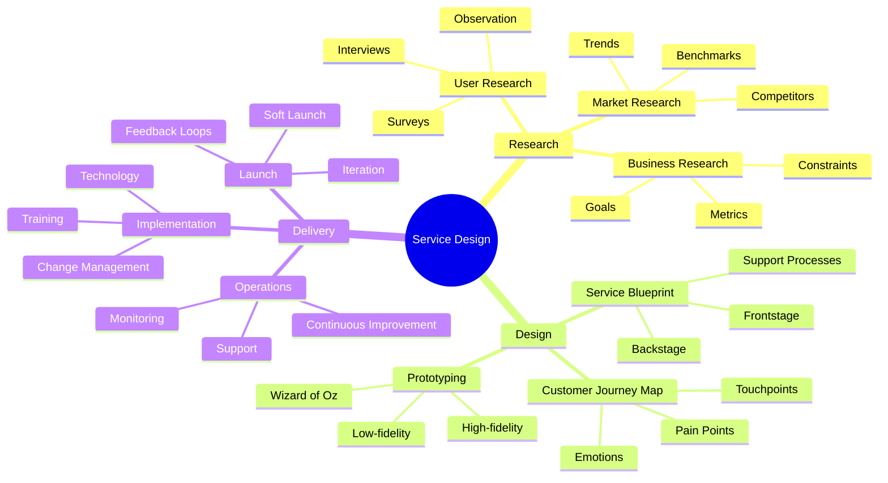
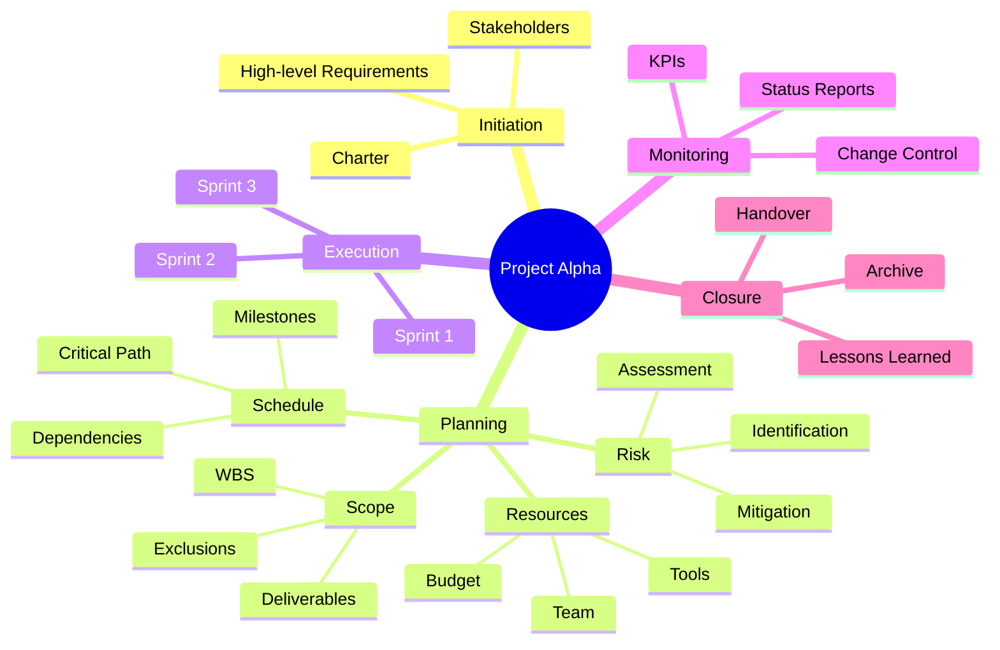
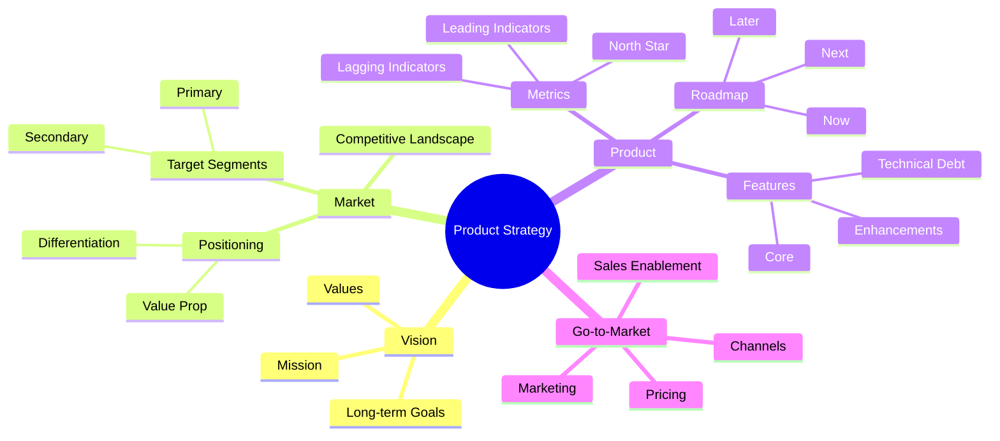
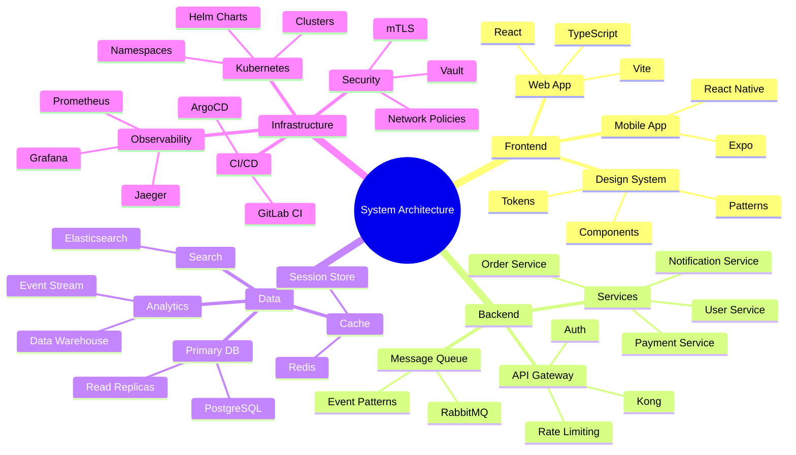
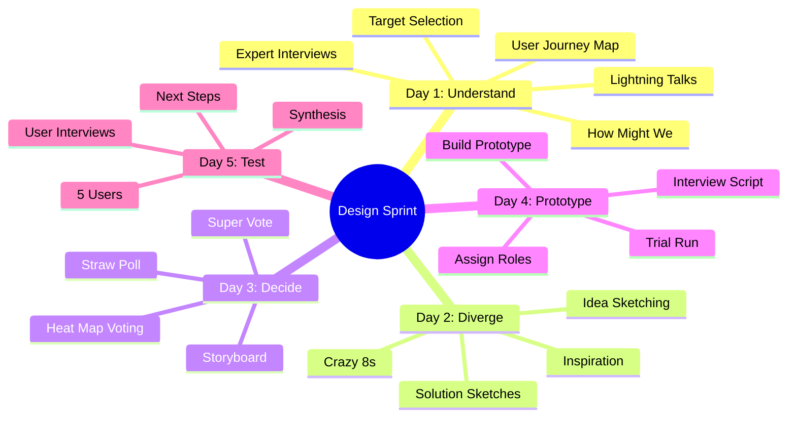

# Mindmap Templates

## 1. Service Design Framework

```mermaid
mindmap
  root((Service Design))
    Research
      User Research
        Interviews
        Surveys
        Observation
      Market Research
        Competitors
        Trends
        Benchmarks
      Business Research
        Goals
        Constraints
        Metrics
    Design
      Service Blueprint
        Frontstage
        Backstage
        Support Processes
      Customer Journey Map
        Touchpoints
        Emotions
        Pain Points
      Prototyping
        Low-fidelity
        High-fidelity
        Wizard of Oz
    Delivery
      Implementation
        Technology
        Training
        Change Management
      Launch
        Soft Launch
        Feedback Loops
        Iteration
      Operations
        Monitoring
        Support
        Continuous Improvement
```

## 2. Project Planning

```mermaid
mindmap
  root((Project Alpha))
    Initiation
      Charter
      Stakeholders
      High-level Requirements
    Planning
      Scope
        WBS
        Deliverables
        Exclusions
      Schedule
        Milestones
        Dependencies
        Critical Path
      Resources
        Team
        Budget
        Tools
      Risk
        Identification
        Assessment
        Mitigation
    Execution
      Sprint 1
      Sprint 2
      Sprint 3
    Monitoring
      KPIs
      Status Reports
      Change Control
    Closure
      Handover
      Lessons Learned
      Archive
```

## 3. Product Strategy

```mermaid
mindmap
  root((Product Strategy))
    Vision
      Mission
      Values
      Long-term Goals
    Market
      Target Segments
        Primary
        Secondary
      Positioning
        Value Prop
        Differentiation
      Competitive Landscape
    Product
      Roadmap
        Now
        Next
        Later
      Features
        Core
        Enhancements
        Technical Debt
      Metrics
        North Star
        Leading Indicators
        Lagging Indicators
    Go-to-Market
      Channels
      Pricing
      Marketing
      Sales Enablement
```

## 4. Architecture Overview

```mermaid
mindmap
  root((System Architecture))
    Frontend
      Web App
        React
        TypeScript
        Vite
      Mobile App
        React Native
        Expo
      Design System
        Components
        Tokens
        Patterns
    Backend
      API Gateway
        Kong
        Rate Limiting
        Auth
      Services
        User Service
        Order Service
        Payment Service
        Notification Service
      Message Queue
        RabbitMQ
        Event Patterns
    Data
      Primary DB
        PostgreSQL
        Read Replicas
      Cache
        Redis
        Session Store
      Search
        Elasticsearch
      Analytics
        Data Warehouse
        Event Stream
    Infrastructure
      Kubernetes
        Clusters
        Namespaces
        Helm Charts
      Observability
        Prometheus
        Grafana
        Jaeger
      CI/CD
        GitLab CI
        ArgoCD
      Security
        Vault
        mTLS
        Network Policies
```

## 5. Workshop Agenda

```mermaid
mindmap
  root((Design Sprint))
    Day 1: Understand
      Lightning Talks
      How Might We
      User Journey Map
      Expert Interviews
      Target Selection
    Day 2: Diverge
      Inspiration
      Idea Sketching
      Crazy 8s
      Solution Sketches
    Day 3: Decide
      Heat Map Voting
      Straw Poll
      Super Vote
      Storyboard
    Day 4: Prototype
      Assign Roles
      Build Prototype
      Interview Script
      Trial Run
    Day 5: Test
      User Interviews
      5 Users
      Synthesis
      Next Steps
```