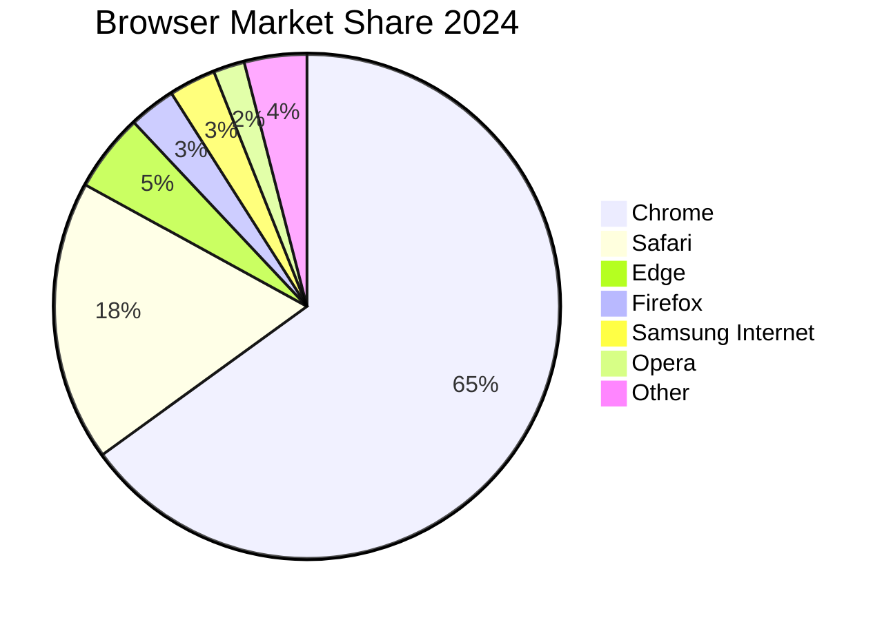
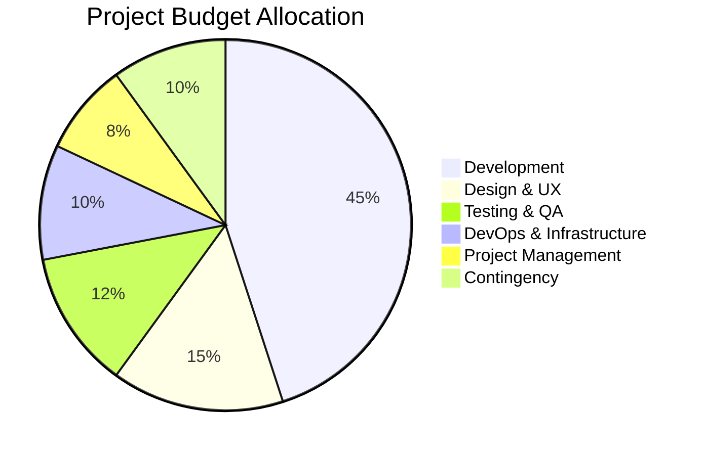
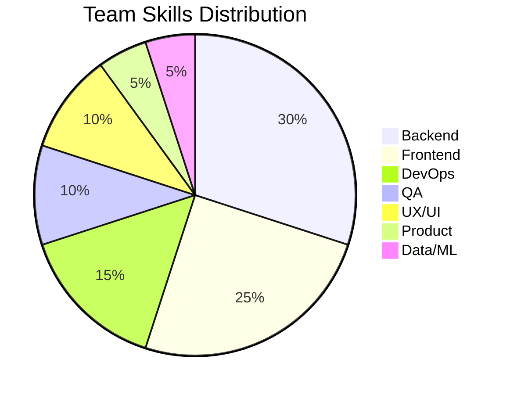
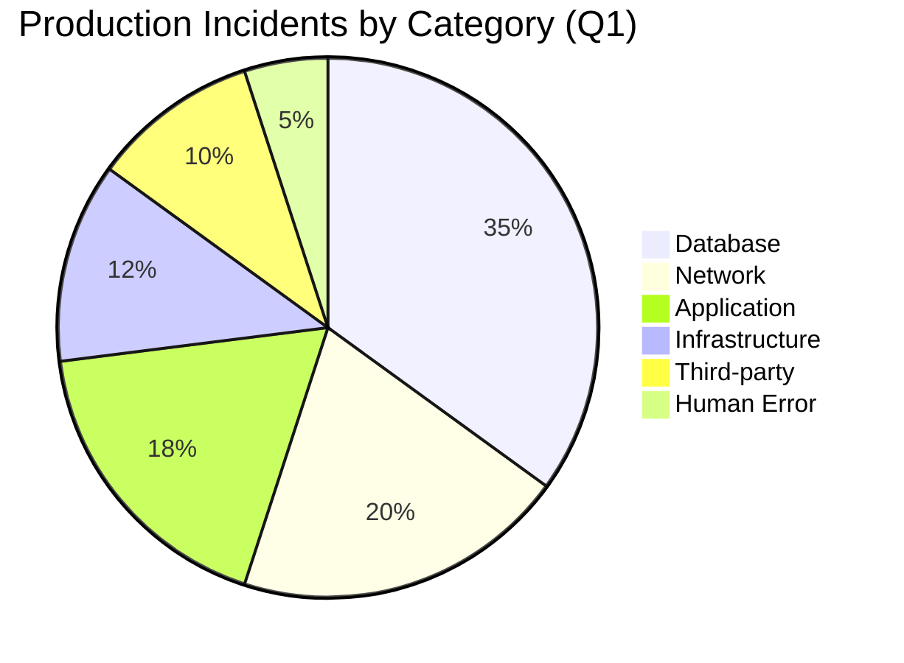
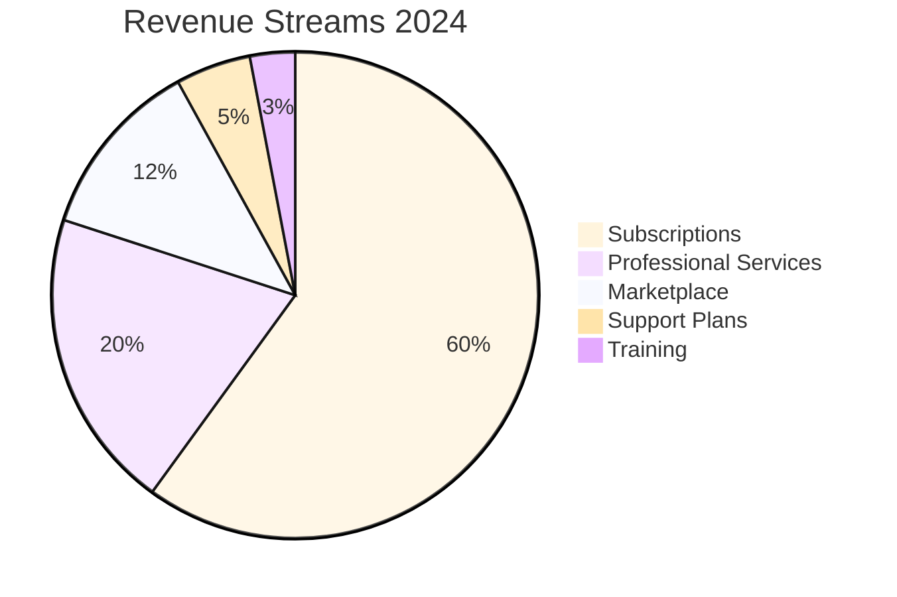
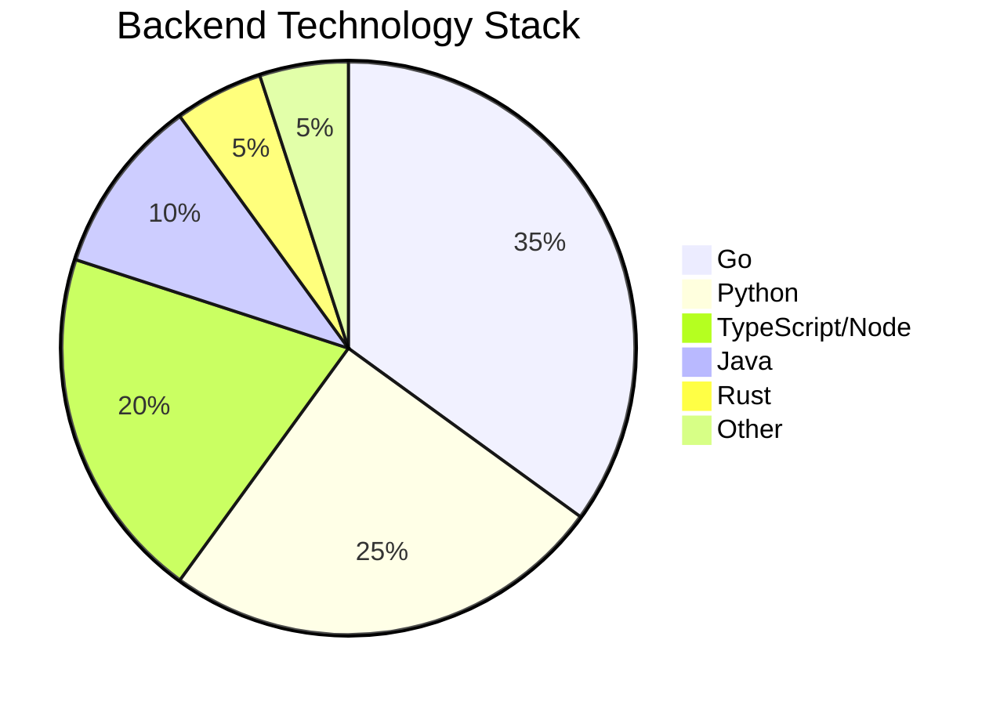
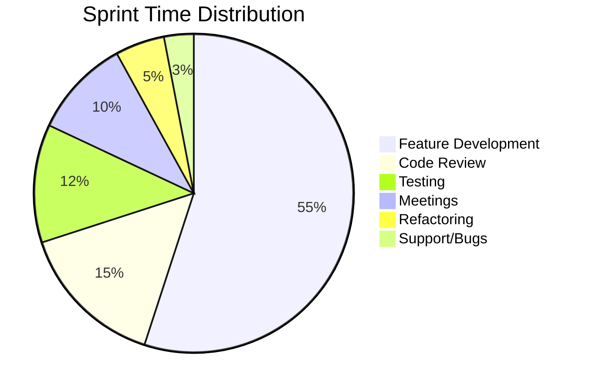
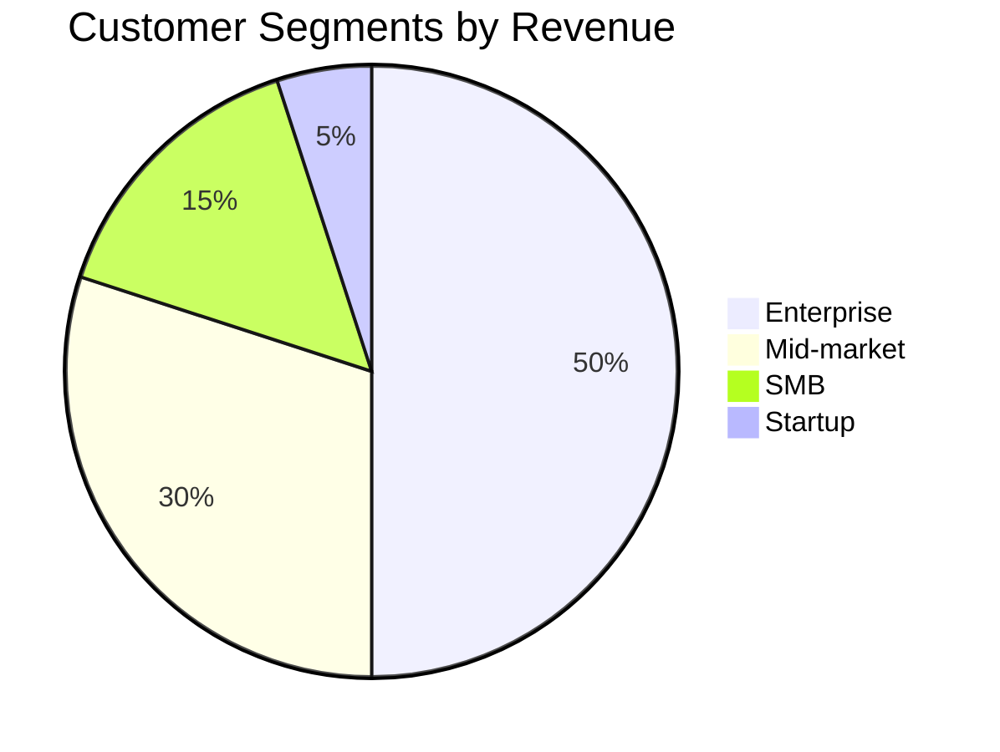

# Pie Chart Templates

## 1. Basic Market Share

## 2. Budget Allocation

## 3. Team Skill Distribution

## 4. Incident Categories

## 5. Donut Style (with center label via config)

## 6. Technology Stack

## 7. Time Distribution

## 8. Customer Segments
