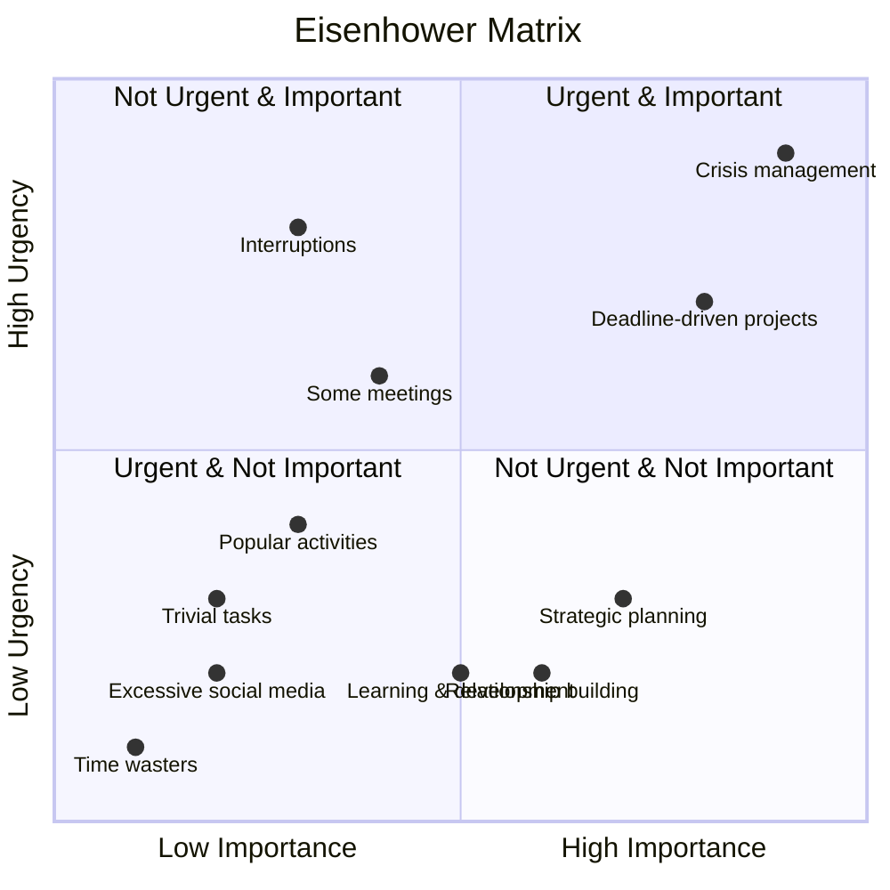
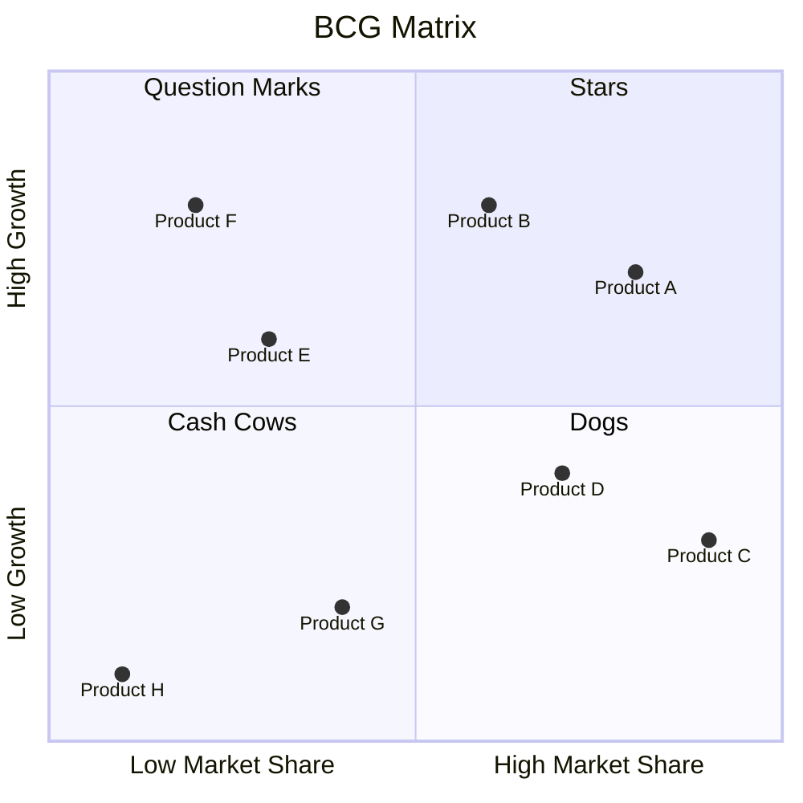
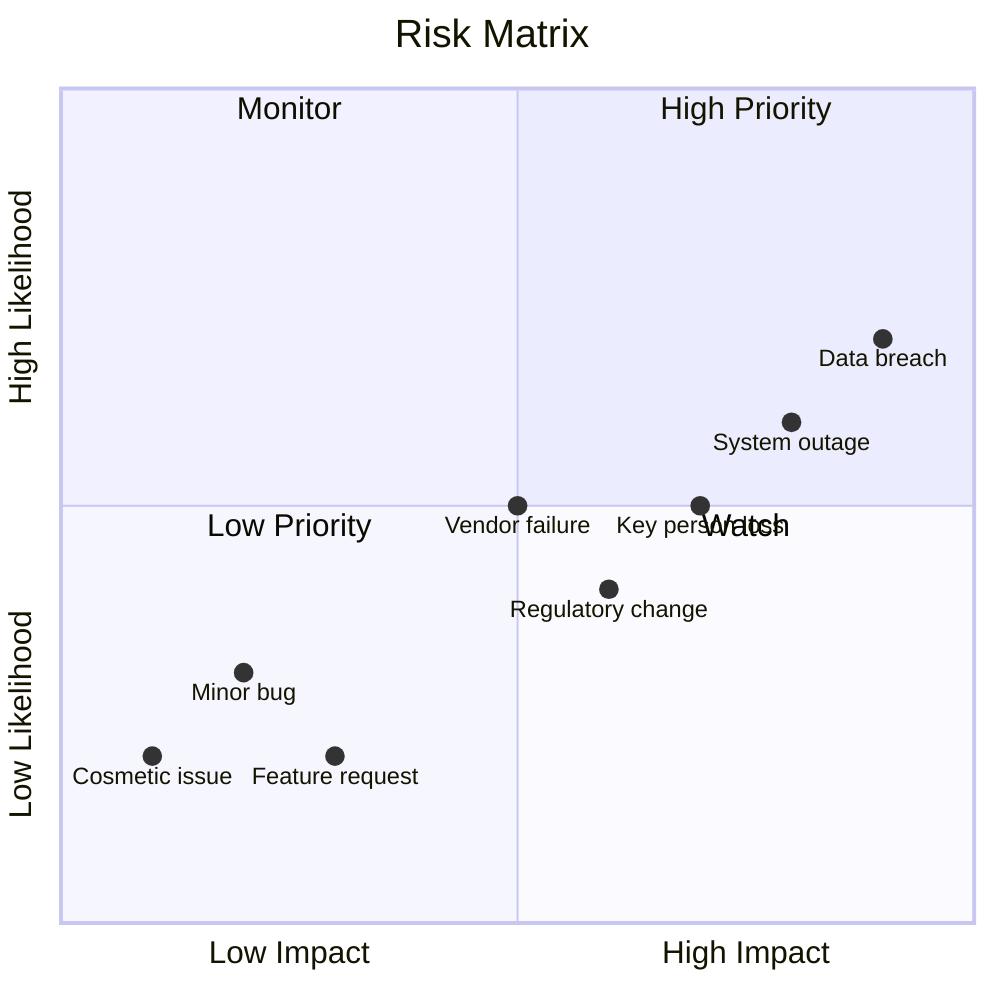
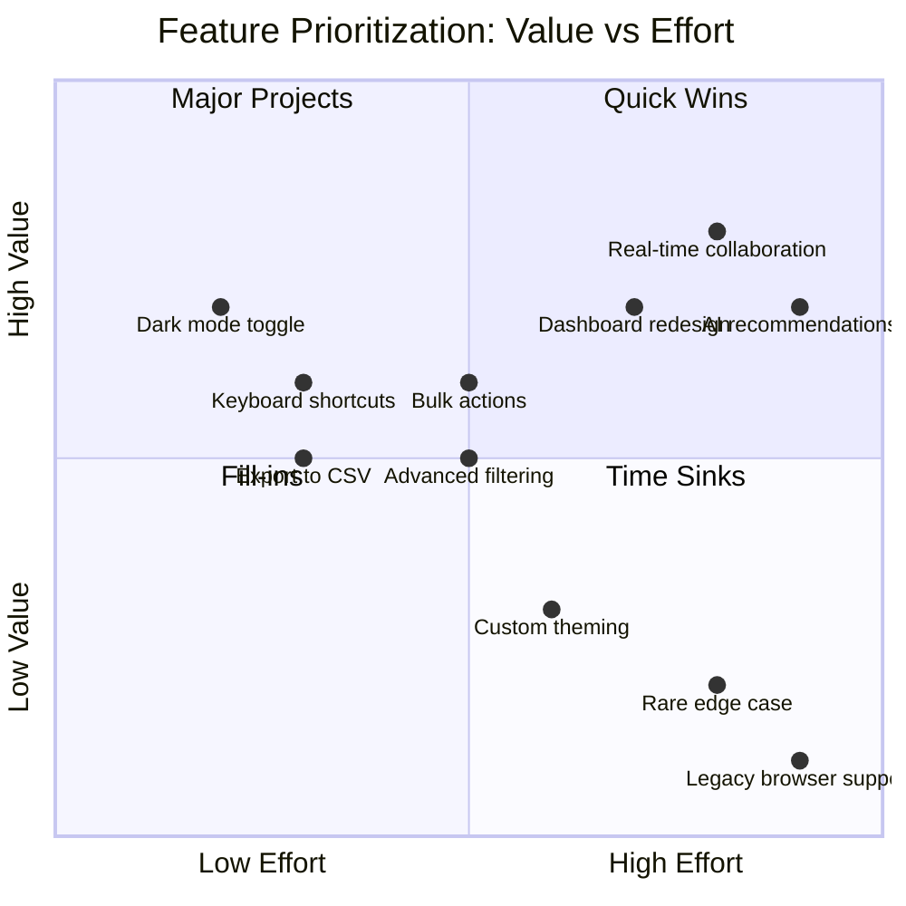

# Quadrant Chart Templates

## 1. Eisenhower Matrix


## 2. BCG Matrix (Product Portfolio)


## 3. Risk Assessment


## 4. Innovation Ambition Matrix
```mermaid
quadrantChart
    title Innovation Ambition Matrix
    x-axis Core --> Transformational
    y-axis Existing Markets --> New Markets
    quadrant-1 Core Innovation
    quadrant-2 Adjacent Innovation
    quadrant-3 Transformational Innovation
    quadrant-4 (Empty)
    "UI improvements": [0.2, 0.2]
    "Performance optimization": [0.3, 0.1]
    "New feature for existing users": [0.4, 0.3]
    "Expand to adjacent segment": [0.5, 0.5]
    "New business model": [0.7, 0.6]
    "Disruptive technology": [0.8, 0.8]
    "New market creation": [0.9, 0.9]
```

## 5. Service Design: Value vs Effort
