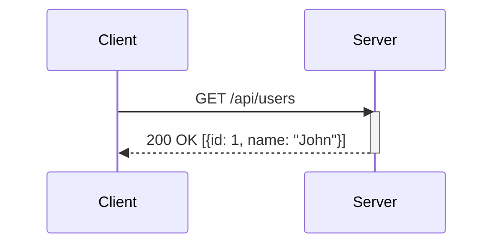
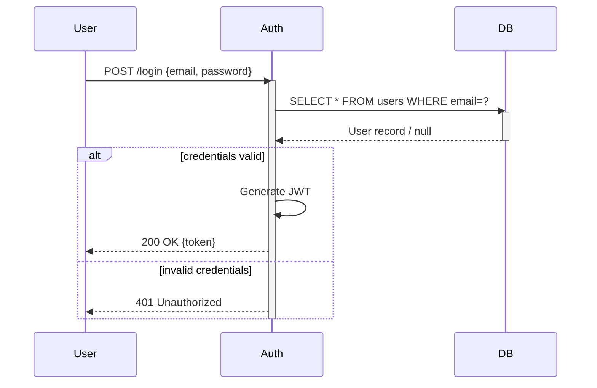
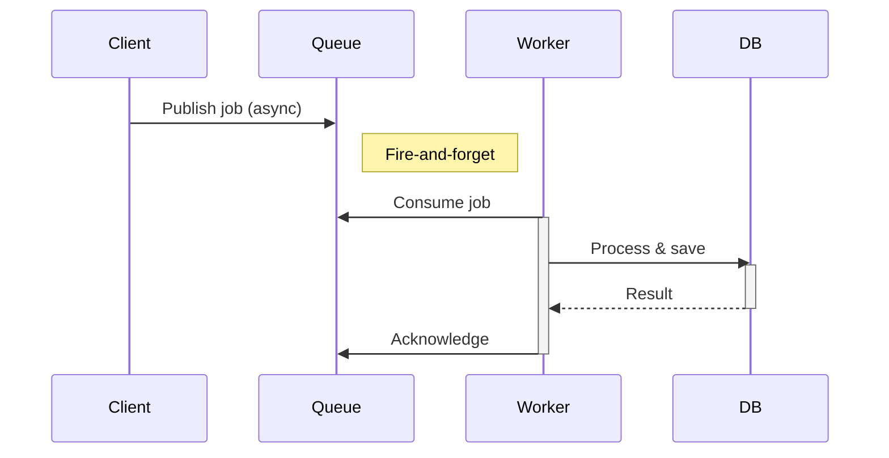
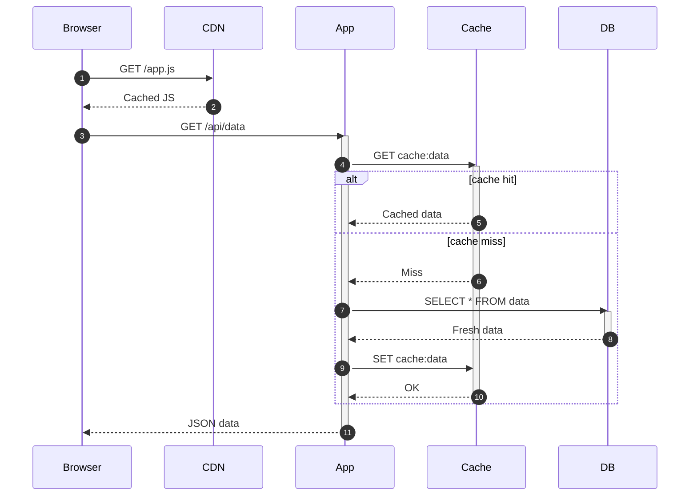
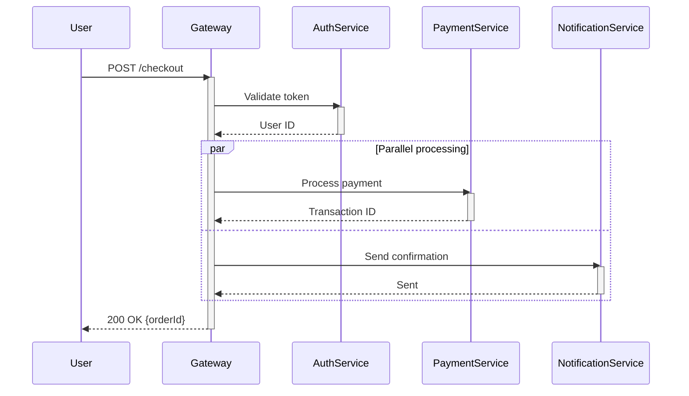

# Sequence Diagram Templates

## 1. Basic Request-Response

## 2. With Fragments (alt, opt, loop)

## 3. Async Communication

## 4. With Lifeline Activation/Deactivation

## 5. Multi-Participant with Parallel
