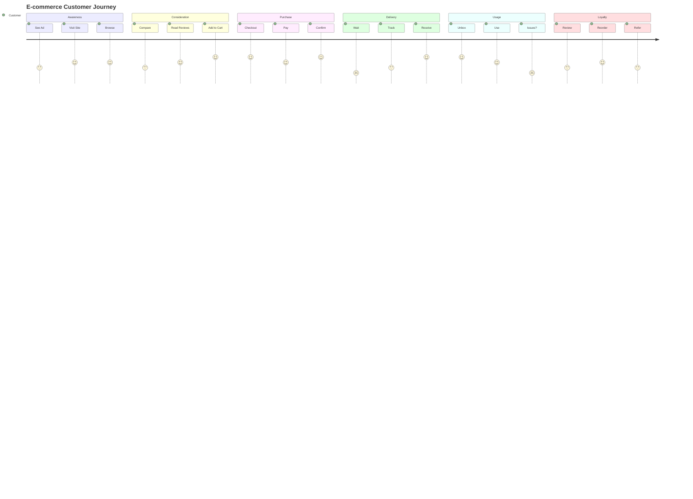
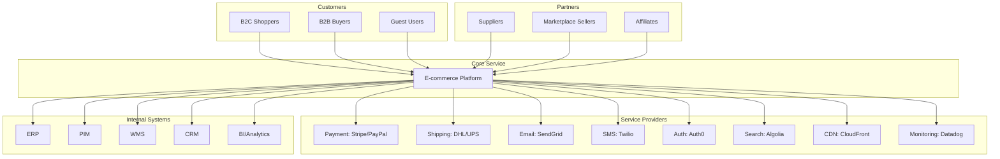
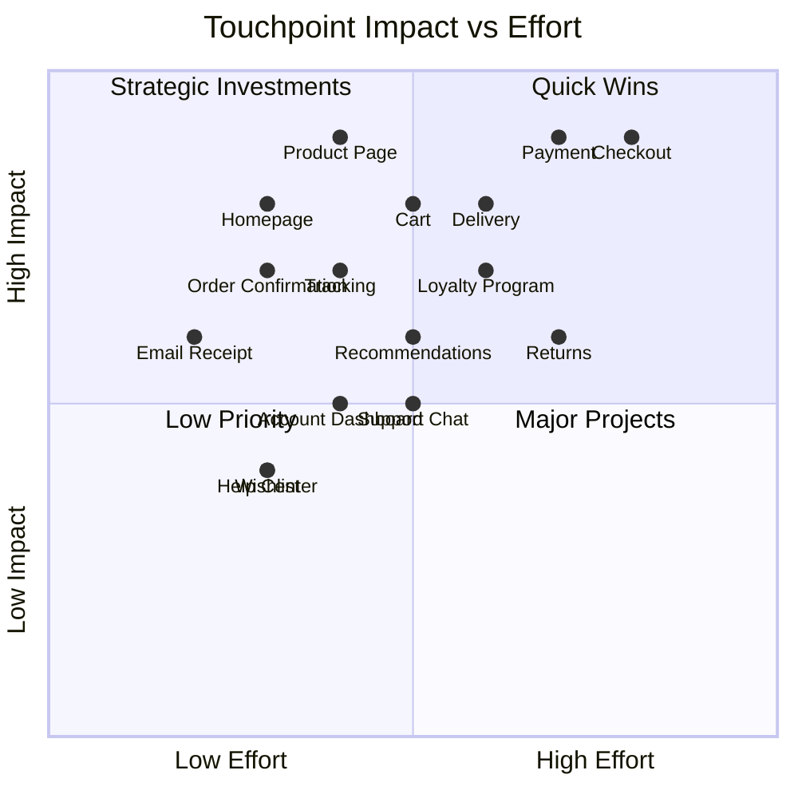
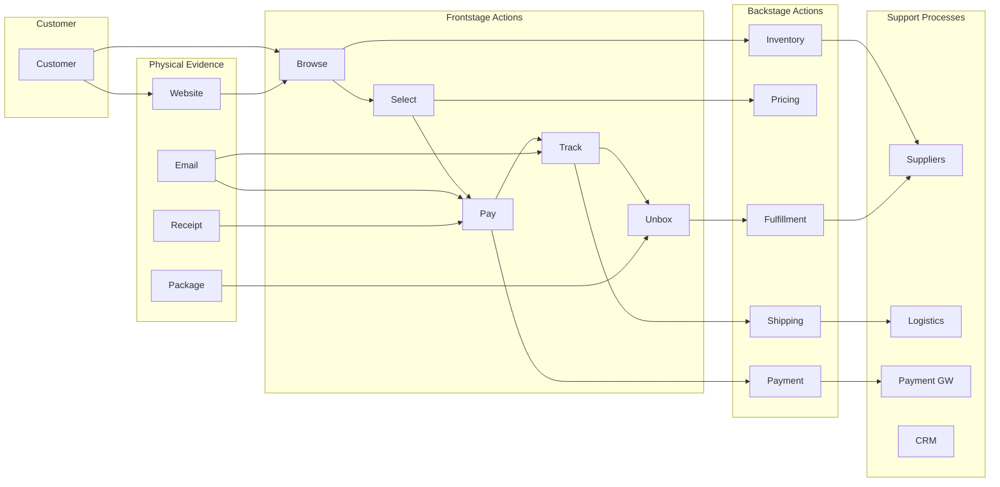
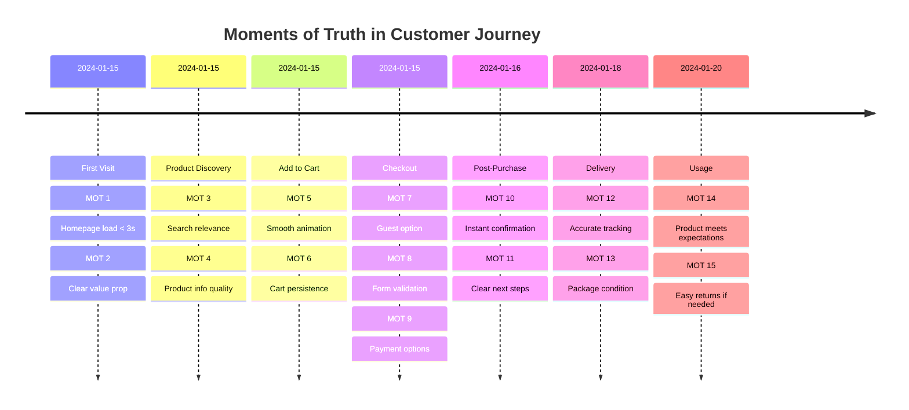

# Service Design Diagram Templates

## 1. Service Blueprint (Comprehensive)

```mermaid
flowchart TB
    subgraph Customer_Actions["Customer Actions"]
        CA1[Browse Website]
        CA2[Select Product]
        CA3[Add to Cart]
        CA4[Checkout]
        CA5[Pay]
        CA6[Receive Confirmation]
        CA7[Track Delivery]
        CA8[Receive Product]
        CA9[Use Product]
        CA10[Support Request]
    end
    
    subgraph Frontstage["Frontstage (Visible)"]
        FS1[Website/UI]
        FS2[Product Pages]
        FS3[Cart Page]
        FS4[Checkout Form]
        FS5[Payment Gateway]
        FS6[Order Confirmation]
        FS7[Tracking Page]
        FS8[Email/SMS]
        FS9[Help Center]
        FS10[Chat Support]
    end
    
    subgraph Backstage["Backstage (Invisible)"]
        BS1[Inventory Check]
        BS2[Price Calculation]
        BS3[Payment Processing]
        BS4[Order Creation]
        BS5[Inventory Reservation]
        BS6[Warehouse Pick]
        BS7[Packing]
        BS8[Shipping Label]
        BS9[Carrier Handoff]
        BS10[Delivery Tracking]
        BS11[Return Processing]
        BS12[Refund Processing]
    end
    
    subgraph Support_Processes["Support Processes"]
        SP1[Inventory Management]
        SP2[Supplier Management]
        SP3[Payment Gateway]
        SP4[Shipping Carriers]
        SP5[CRM System]
        SP6[Analytics]
        SP7[Fraud Detection]
    end
    
    CA1 --> FS1
    CA2 --> FS2
    CA3 --> FS3
    CA4 --> FS4
    CA5 --> FS5
    CA6 --> FS6
    CA7 --> FS7
    CA8 --> FS8
    CA9 --> FS1
    CA10 --> FS9
    CA10 --> FS10
    
    FS1 --> BS1
    FS2 --> BS1
    FS3 --> BS2
    FS4 --> BS2
    FS5 --> BS3
    FS5 --> BS7
    FS6 --> BS4
    FS7 --> BS10
    FS8 --> BS4
    FS9 --> BS11
    FS10 --> BS11
    
    BS3 --> SP3
    BS6 --> SP1
    BS7 --> SP1
    BS8 --> SP4
    BS9 --> SP4
    BS11 --> SP2
    BS12 --> SP3
    BS1 --> SP1
    BS2 --> SP6
    BS4 --> SP5
    BS4 --> SP7
    
    classDef customer fill:#e3f2fd,stroke:#1976d2
    classDef front fill:#f3e5f5,stroke:#7b1fa2
    classDef back fill:#fff3e0,stroke:#f57c00
    classDef support fill:#e8f5e9,stroke:#388e3c
    
    class CA1,CA2,CA3,CA4,CA5,CA6,CA7,CA8,CA9,CA10 customer
    class FS1,FS2,FS3,FS4,FS5,FS6,FS7,FS8,FS9,FS10 front
    class BS1,BS2,BS3,BS4,BS5,BS6,BS7,BS8,BS9,BS10,BS11,BS12 back
    class SP1,SP2,SP3,SP4,SP5,SP6,SP7 support
```

## 2. Customer Journey Map with Emotions

## 3. Service Ecosystem Map

## 4. Touchpoint Analysis

## 5. Service Design: Frontstage/Backstage Detail

## 6. Moments of Truth
