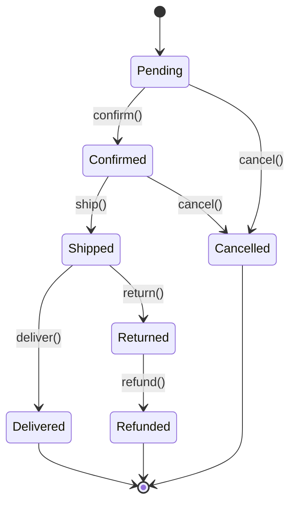
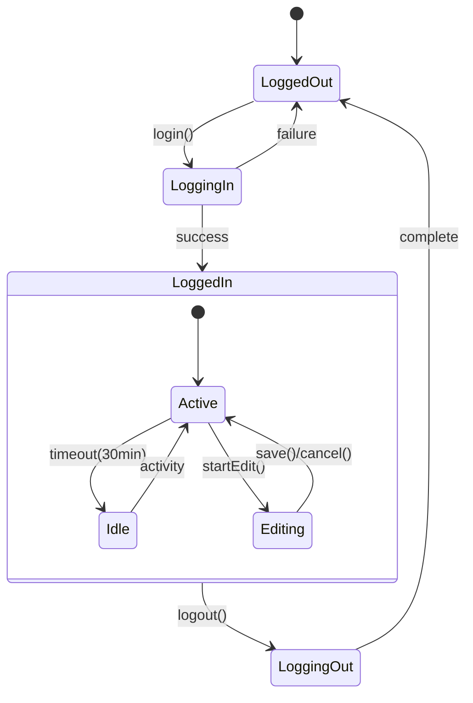
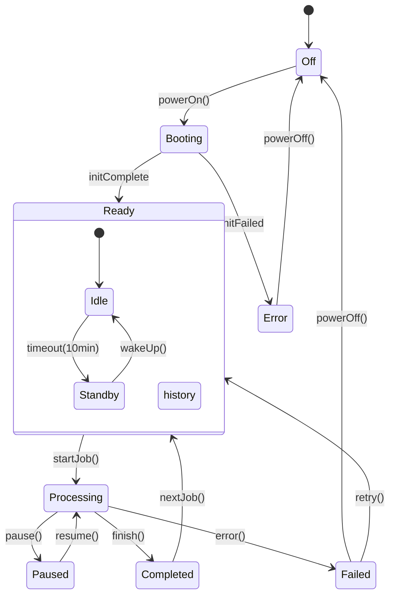
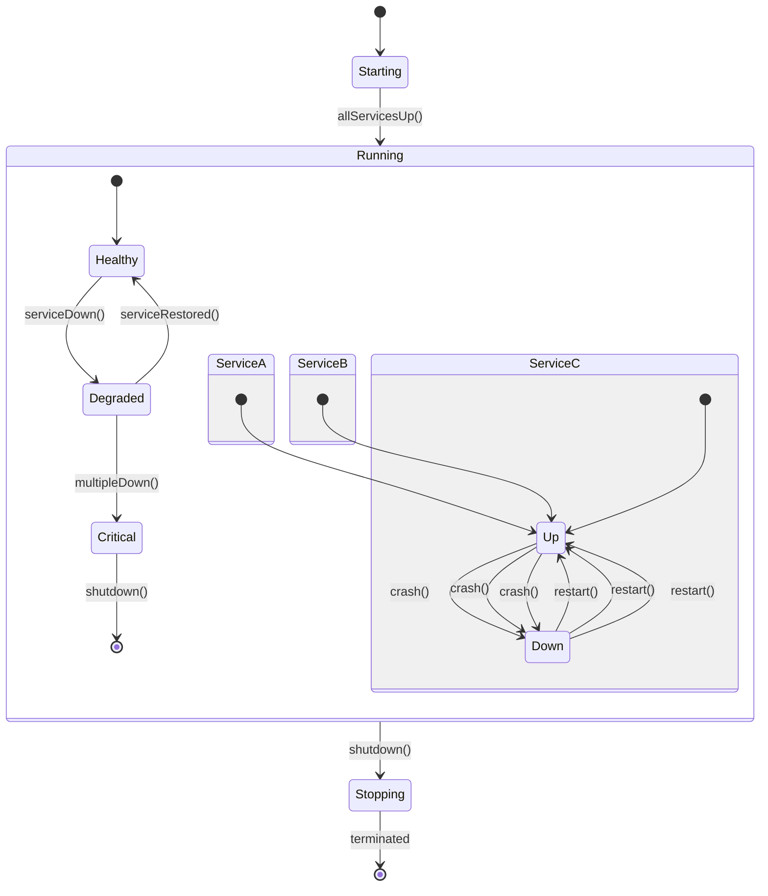
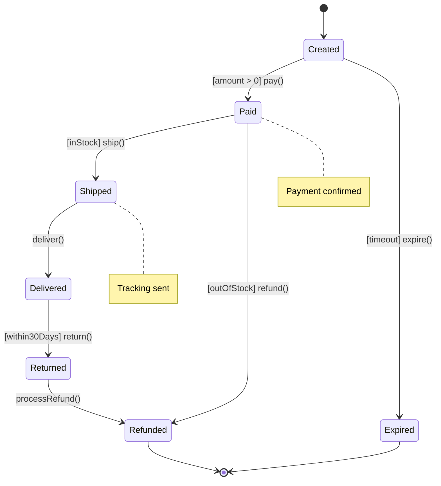

# State Diagram Templates

## 1. Basic Order States

```mermaid
stateDiagram-v2
    [*] --> Pending
    Pending --> Confirmed: confirm()
    Pending --> Cancelled: cancel()
    Confirmed --> Shipped: ship()
    Confirmed --> Cancelled: cancel()
    Shipped --> Delivered: deliver()
    Shipped --> Returned: return()
    Delivered --> [*]
    Returned --> Refunded: refund()
    Refunded --> [*]
    Cancelled --> [*]
```

## 2. Composite States (User Session)

```mermaid
stateDiagram-v2
    [*] --> LoggedOut
    LoggedOut --> LoggingIn: login()
    LoggingIn --> LoggedIn: success
    LoggingIn --> LoggedOut: failure
    
    state LoggedIn {
        [*] --> Active
        Active --> Idle: timeout(30min)
        Idle --> Active: activity
        Active --> Editing: startEdit()
        Editing --> Active: save()/cancel()
    }
    
    LoggedIn --> LoggingOut: logout()
    LoggingOut --> LoggedOut: complete
```

## 3. With History & Choice

```mermaid
stateDiagram-v2
    [*] --> Off
    Off --> Booting: powerOn()
    Booting --> Ready: initComplete
    Booting --> Error: initFailed
    Error --> Off: powerOff()
    Ready --> Processing: startJob()
    Processing --> Paused: pause()
    Paused --> Processing: resume()
    Processing --> Completed: finish()
    Processing --> Failed: error()
    Completed --> Ready: nextJob()
    Failed --> Ready: retry()
    Failed --> Off: powerOff()
    
    state Ready {
        [*] --> Idle
        Idle --> Standby: timeout(10min)
        Standby --> Idle: wakeUp()
        H* : history
    }
```

## 4. Concurrent States (Microservice)

```mermaid
stateDiagram-v2
    [*] --> Starting
    Starting --> Running: allServicesUp()
    
    state Running {
        [*] --> Healthy
        Healthy --> Degraded: serviceDown()
        Degraded --> Healthy: serviceRestored()
        Degraded --> Critical: multipleDown()
        Critical --> [*]: shutdown()
        
        state ServiceA {
            [*] --> Up
            Up --> Down: crash()
            Down --> Up: restart()
        }
        state ServiceB {
            [*] --> Up
            Up --> Down: crash()
            Down --> Up: restart()
        }
        state ServiceC {
            [*] --> Up
            Up --> Down: crash()
            Down --> Up: restart()
        }
    }
    
    Running --> Stopping: shutdown()
    Stopping --> [*]: terminated
```

## 5. With Guards & Actions

```mermaid
stateDiagram-v2
    [*] --> Created
    Created --> Paid: [amount > 0] pay()
    Created --> Expired: [timeout] expire()
    Paid --> Shipped: [inStock] ship()
    Paid --> Refunded: [outOfStock] refund()
    Shipped --> Delivered: deliver()
    Delivered --> Returned: [within30Days] return()
    Returned --> Refunded: processRefund()
    Refunded --> [*]
    Expired --> [*]
    
    note right of Paid: Payment confirmed
    note right of Shipped: Tracking sent
```