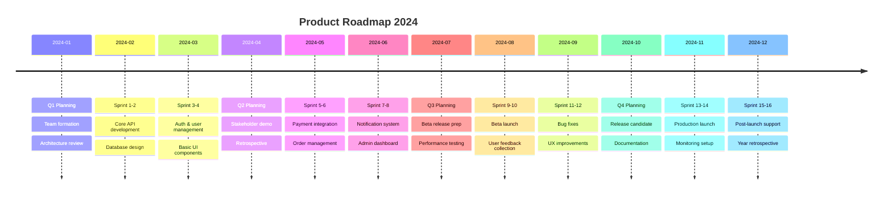
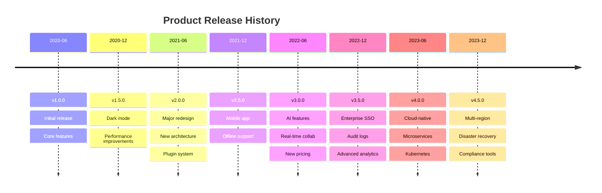
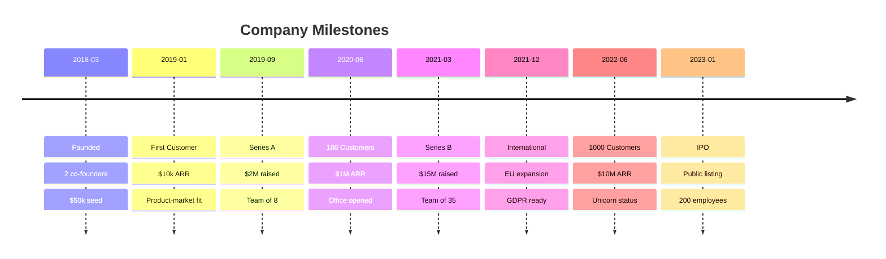
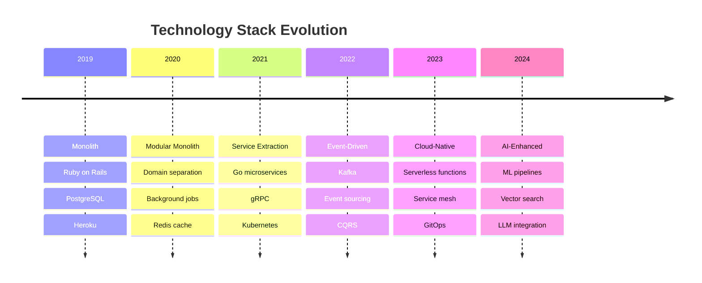
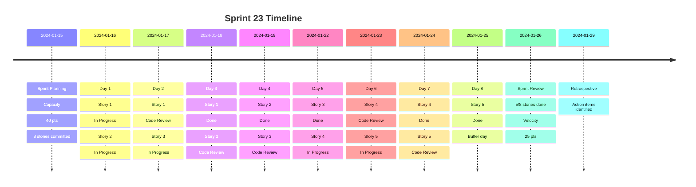

# Timeline Templates

## 1. Project Roadmap


## 2. Product Release History


## 3. Company Milestones


## 4. Technology Evolution


## 5. Sprint Timeline


## 6. Incident Timeline
```mermaid
timeline
    title Incident #INC-2024-001: Database Outage
    2024-01-15 14:32 : Alert triggered
                     : CPU > 90% on primary
    2024-01-15 14:35 : On-call paged
                     : Investigation started
    2024-01-15 14:40 : Root cause identified
                     : Long-running query
    2024-01-15 14:42 : Query killed
                     : CPU dropping
    2024-01-15 14:45 : Failover initiated
                     : Standby promoted
    2024-01-15 14:50 : Service restored
                     : Monitoring verified
    2024-01-15 15:00 : Post-incident review
                     : Action items created
    2024-01-16 10:00 : RCA published
                     : Query optimization scheduled
```