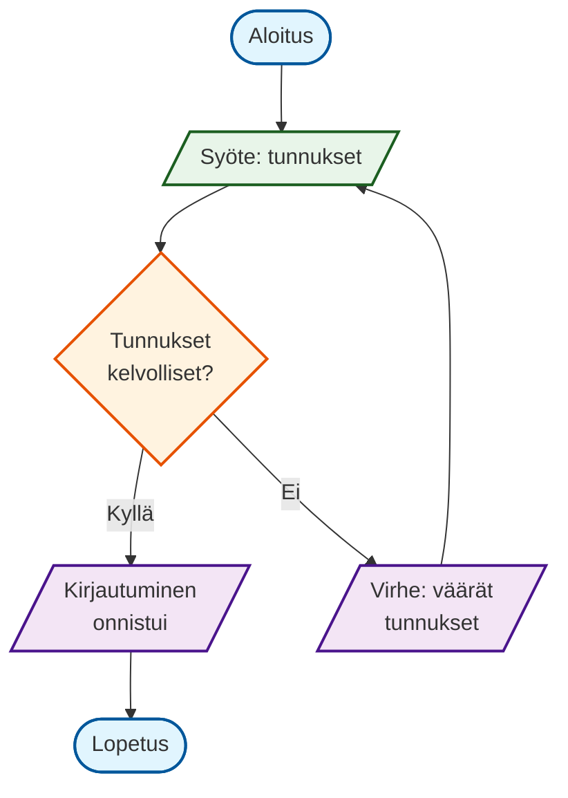
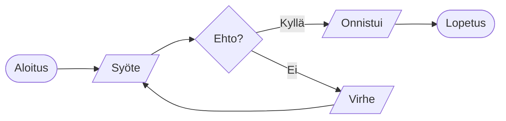
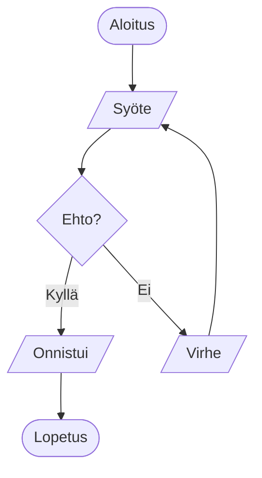
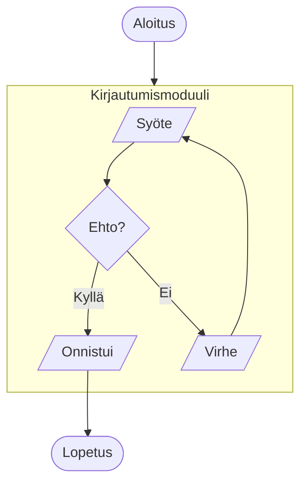

# Perusvirta (Flowchart) - Kirjautuminen

## Kuvaus
Yksinkertainen käyttäjän kirjautumisprosessi demonstroimaan perus Flowchart-elementtejä: aloitus/lopetus, syöte/tulo, besluutus, prosessi ja silmukat.

## Lähdekoodi

## Renderöity

## Selitys

| Rivit | Elementti | Syntaksi | Kuvaus |
|-------|-----------|----------|--------|
| 1 | Diagrammi | `flowchart TD` | Top-Down suunta |
| 2 | Solmut + nuoli | `Start([Aloitus]) --> Input[/.../]` | Ympyrä `()`, parallelogrammi `[/ /]` |
| 3 | Besluutus | `Validate{...}` | Rombi `{}` |
| 4 | Haara Kyllä | `Validate -->|Kyllä| Success[/.../]` | Merkintä nuolen päällä `|teksti|` |
| 5 | Haara Ei | `Validate -->|Ei| Error[/.../]` | Toinen haarautuminen |
| 6 | Silmukka | `Error --> Input` | Takaisin syöttöön |
| 7 | Lopetus | `Success --> End([Lopetus])` | Ympyrä-solmu |
| 9-12 | Tyylit | `classDef nimi fill:,stroke:,stroke-width:` | CSS-tyylit luokille |
| 14-17 | Luokitus | `class SolmuID luokka` | Solmujen tyylien määrittely |

## Solmumuotojen yhtälöt

| Muoto | Syntaksi | Esimerkki | Käyttö |
|-------|----------|-----------|--------|
| Suorakulmio | `id[teksti]` | `A[Prosessi]` | Yleinen prosessi |
| Pyöristetty | `id(teksti)` | `A(Aloitus)` | Aloitus/lopetus |
| Rombi | `id{teksti}` | `A{Ehto?}` | Besluutus |
| Ympyrä | `id((teksti))` | `A((Käynnistys))` | Aloitus/lopetus (vaihtoehto) |
| Parallelogrammi | `id[/teksti/]` | `A[/Syöte/]` | Syöte/tulo |
| Toinen parall. | `id[\teksti\]` | `A[\Tulos\]` | Tulo/syöte (toinen suunta) |
| Asymmetrinen | `id>teksti]` | `A>Viesti]` | Viesti/data |
| Alikäsittely | `id[["teksti"]]` | `A[["Aliohjelma"]]` | Aliohjelmakutsu |
| Synkronointi | `id[("teksti")]` | `A[("Synkki")]` | Synkronointipiste |
| Data | `id[/"teksti"/]` | `A[/"Data"/]` | Data-objekti |

## Yleiset virheet & korjaukset

| Virhe | Oire | Korjaus |
|-------|------|---------|
| Puuttuva `flowchart` | Ei renderöi | Lisää `flowchart TD` ensimmäisenä rivinä |
| Epätasapainoiset sulut | Virheilmoitus parserissa | Tarkista `()`, `{}`, `[]`, `[/ /]` |
| Duplicate ID | Vain ensimmäinen näkyy | Käytä yksilöllisiä ID:tä (`Start`, `Start2`) |
| Viittaus olemattomaan | Nuoli ei näy / virhe | Varmista että kohdesolmu on määritelty |
| Erikoismerkit ID:ssä | Parsing-virhe | Käytä vain `a-z`, `A-Z`, `0-9`, `_` |
| Rivinvaihto merkinnässä | Rikki merkintä | Käytä `\n` merkinnässä: `\|Kyllä\nJatka\|` |

## Variatiot

### 1. Vaakasuunntainen (LR)

### 2. Ilman tyylejä (minimaalinen)

### 3. Alikatsaus (subgraph)

## Tags
`#flowchart` `#beginner` `#authentication` `#decision` `#loop`

## Viittaukset
- [[02-syntaksi/flowchart|Flowchart syntaksi im detail]]
- [[01-diagrammit/flowchart|Flowchart syväsukellus]]
- [[03-esimerkit/flowchart/styling|Tyylit & luokat (seuraava)]]