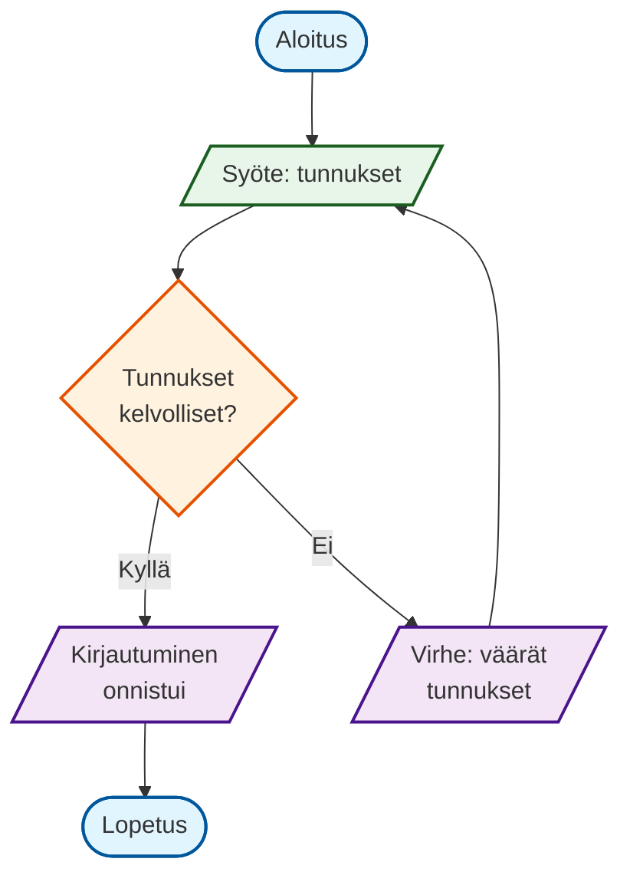

# Esimerkkikokoelma - Index

Kuratoidut, testatut ja dokumentoidut esimerkit per diagrammityyppi.

## Per diagrammityyppi

| Tyyppi | Tiedosto | Kuvaus | Valmis |
|--------|----------|--------|--------|
| Flowchart | [[03-esimerkit/flowchart/basic|Perusvirtaus]] | TD, solmut, nuolet, besluut | ✅ |
| Flowchart | [[03-esimerkit/flowchart/styling|Tyylit & luokat]] | classDef, click, linkit | ✅ |
| Flowchart | [[03-esimerkit/flowchart/subgraphs|Alikatsaukset]] | subgraph, direction | 🔄 |
| Sequence | [[03-esimerkit/sequence/basic|Perusviestintä]] | actor, participant, sync/async | ✅ |
| Sequence | [[03-esimerkit/sequence/advanced|Edistynyt]] | alt, opt, loop, par, critical | 🔄 |
| Class | [[03-esimerkit/class/basic|Perusluokat]] | attributes, methods, visibility | ✅ |
| Class | [[03-esimerkit/class/relationships|Suhteet]] | inheritance, composition, dependency | 🔄 |
| State | [[03-esimerkit/state/basic|Perustilat]] | state, transition, composite | ✅ |
| State | [[03-esimerkit/state/advanced|Edistynyt]] | history, fork/join, concurrent | 🔄 |
| ER | [[03-esimerkit/er/basic|Perus-EER]] | entity, relationship, attributes | ✅ |
| Gantt | [[03-esimerkit/gantt/basic|Projektisuunnittelu]] | tasks, milestones, deps | ✅ |
| GitGraph | [[03-esimerkit/gitgraph/basic|Haarautuminen]] | branch, commit, merge, tag | ✅ |
| Journey | [[03-esimerkit/journey/basic|Käyttäjäpolku]] | tasks, scores, actors | 🔄 |
| Pie | [[03-esimerkit/pie/basic|Tortakaavio]] | data, labels, styling | ✅ |
| Mindmap | [[03-esimerkit/mindmap/basic|Mielikartta]] | root, branches, icons | 🔄 |

## Esimerkin rakenne

Jokainen esimerkki sisältää:

```markdown
# [Nimi]

## Kuvaus
Mitä tämä esittää ja milloin käyttää.

## Lähdekoodi
```mermaid
[mermaid-koodi]
```

## Renderöity


## Selitys
Rivikohtainen käynti läpi.

## Variatiot
- [Variatio 1](linkki)
- [Variatio 2](linkki)

## Yleiset virheet
- Virhe 1 → korjaus
- Virhe 2 → korjaus

## Tags
`#flowchart` `#beginner` `#authentication`
```

## Malliesimerkki: Perusvirta (Flowchart)

### Lähdekoodi


### Selitys
| Rivit | Mitä |
|-------|------|
| 1 | Diagrammin tyyppi + suunta (Top-Down) |
| 2 | Aloitussolmu (ympyrä) → syöttösolmu (parallelogrammi) |
| 3 | Besluutussolmu (rombi) |
| 4-5 | Haarautuminen: kyllä/ei -nuolet merkinnöillä |
| 6 | Virhepalautus silmukka |
| 7 | Onnistuminen → lopetus |
| 9-13 | Tyylimäärittelyt (classDef) |
| 15-18 | Luokkien sijoittaminen solmuihin |

## Tägistä hakeminen

```dataview
TABLE type, status, tags
FROM "03-esimerkit"
WHERE type = "example"
SORT tags
```

## Seuraavat vaiheet
- [ ] Luo mallipohja uusille esimerkeille
- [ ] Täydennä puuttuvat perusesimerkit (✅ = valmis, 🔄 = kesken)
- [ ] Lisää edistyneet variatiot
- [ ] Luo "anti-patterns" -kansio virheellisistä esimerkeistä