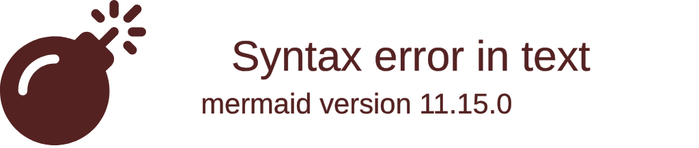

```mermaid
architecture-beta
    group cloud(cloud)[Cloud]
    group k8s(cluster)[Kubernetes]
    
    service web(frontend)[Web App] in k8s
    service api(gateway)[API Gateway] in k8s
    service svc[Service] in k8s
    database db[(Database)] in cloud
    queue mq[Message Queue] in cloud
    
    web:L -- R:api
    api:B -- T:svc
    svc:R -- L:db
    svc:B -- T:mq
```