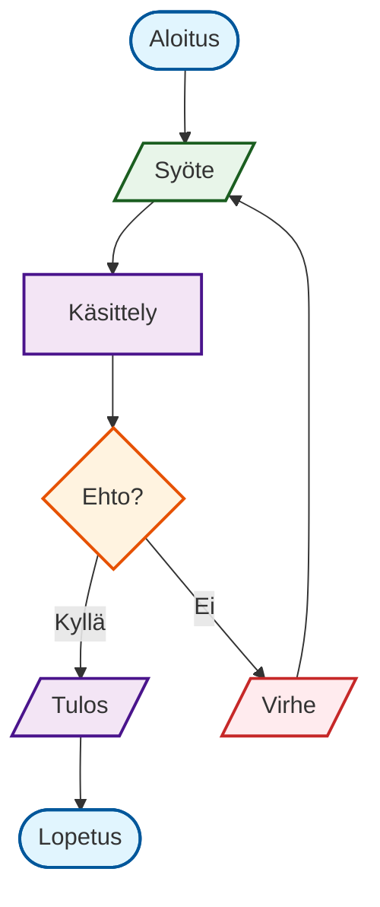

```mermaid
flowchart TD
    Start([Aloitus]) --> Input[/Syöte/]
    Input --> Process[Käsittely]
    Process --> Decision{Ehto?}
    Decision -->|Kyllä| Output[/Tulos/]
    Decision -->|Ei| Error[/Virhe/]
    Error --> Input
    Output --> End([Lopetus])

    classDef startEnd fill:#e1f5fe,stroke:#01579b,stroke-width:2px;
    classDef process fill:#f3e5f5,stroke:#4a148c,stroke-width:2px;
    classDef decision fill:#fff3e0,stroke:#e65100,stroke-width:2px;
    classDef io fill:#e8f5e9,stroke:#1b5e20,stroke-width:2px;
    classDef error fill:#ffebee,stroke:#c62828,stroke-width:2px;

    class Start,End startEnd;
    class Process,Output process;
    class Decision decision;
    class Input io;
    class Error error;
```