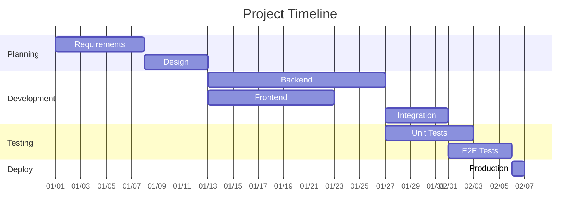

```mermaid
gantt
    title Project Timeline
    dateFormat  YYYY-MM-DD
    axisFormat  %m/%d
    
    section Planning
    Requirements           :a1, 2024-01-01, 7d
    Design                 :a2, after a1, 5d
    
    section Development
    Backend                :b1, after a2, 14d
    Frontend               :b2, after a2, 10d
    Integration            :b3, after b1 b2, 5d
    
    section Testing
    Unit Tests             :c1, after b1, 7d
    E2E Tests              :c2, after b3, 5d
    
    section Deploy
    Production             :d1, after c2, 1d
```