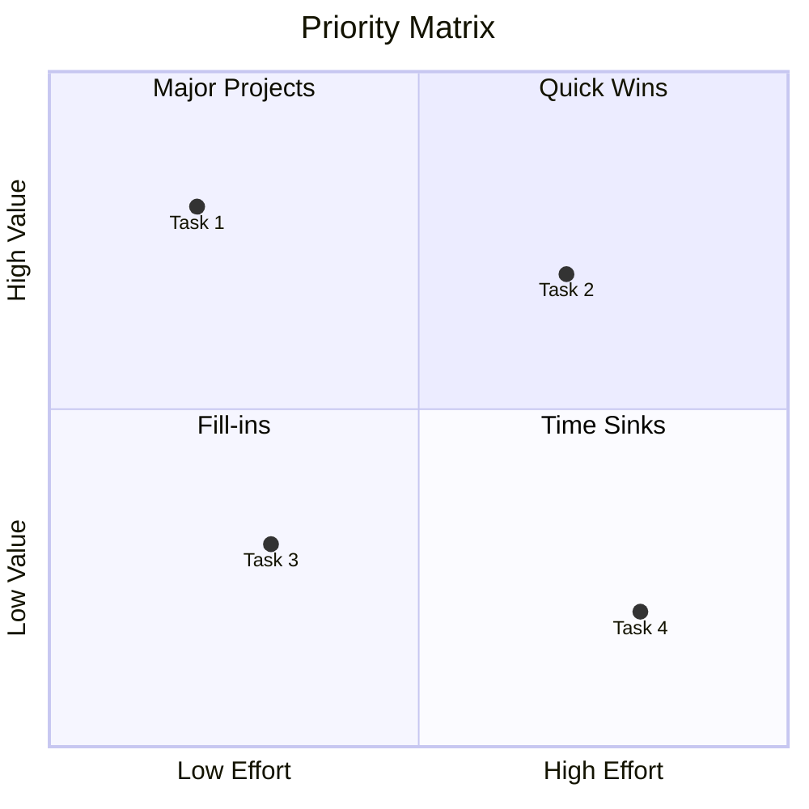

```mermaid
quadrantChart
    title Priority Matrix
    x-axis Low Effort --> High Effort
    y-axis Low Value --> High Value
    quadrant-1 Quick Wins
    quadrant-2 Major Projects
    quadrant-3 Fill-ins
    quadrant-4 Time Sinks
    "Task 1": [0.2, 0.8]
    "Task 2": [0.7, 0.7]
    "Task 3": [0.3, 0.3]
    "Task 4": [0.8, 0.2]
```