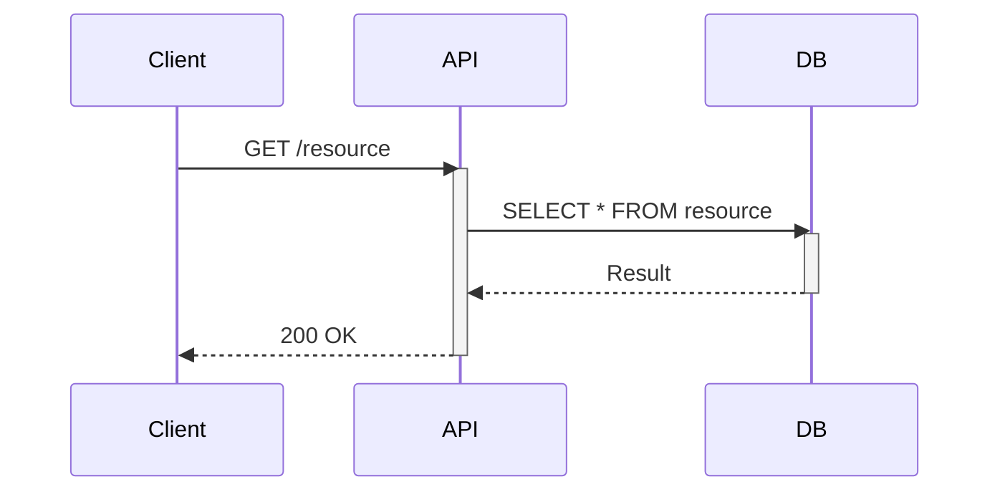

```mermaid
sequenceDiagram
    participant Client
    participant API
    participant DB
    Client->>API: GET /resource
    activate API
    API->>DB: SELECT * FROM resource
    activate DB
    DB-->>API: Result
    deactivate DB
    API-->>Client: 200 OK
    deactivate API
```