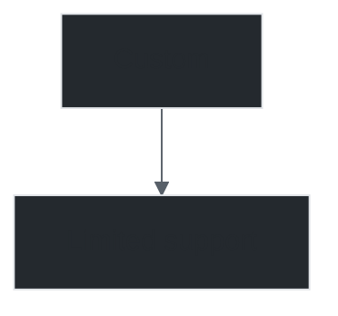

# Mermaid GitHub Compatibility Skill

## Description
GitHub-specific rendering compatibility layer. Ensures Mermaid diagrams render correctly on GitHub (README.md, issues, PRs, Wiki, GitHub Pages) by handling font configs, label sanitization, GitHub Actions integration, and GitHub Pages deployment.

## Capabilities
- **Font configuration**: GitHub-specific font fallbacks for consistent rendering
- **Label sanitization pipeline**: ASCII-only, emoji-free, escape-safe labels
- **GitHub Actions integration**: CI/CD rendering with artifact upload
- **GitHub Pages deployment**: Automated diagram rendering for static sites
- **GitHub-flavored Markdown compatibility**: Works in README.md, issues, PRs, Wiki
- **Theme compatibility**: GitHub-supported themes (default, dark, forest, neutral, base)
- **Responsive sizing**: Auto-fit for GitHub's content width
- **Cross-platform rendering**: Consistent across GitHub.com, GitHub Enterprise, GitHub Pages

## GitHub Rendering Constraints

### Supported
- Themes: `default`, `dark`, `forest`, `neutral`, `base`
- Diagram types: All 14+ types supported by mermaid.js
- Mermaid.js version: GitHub uses mermaid@10.x (check current)

### Not Supported / Limited
- Custom fonts (use system fonts)
- Custom CSS (limited to themeVariables)
- External images (use base64 or GitHub-hosted)
- Interactive features (click handlers don't work in static rendering)
- Custom themes (only predefined themes)

### Label Constraints
- **ASCII-only**: Labels must be ASCII-only for reliable rendering
- **No emojis**: Emojis may not render or break layout
- **Escape sequences**: `\n`, `\t`, `\r` must be normalized
- **Subgraph labels**: ASCII-only, no special characters
- **Length limits**: Very long labels may be truncated

## GitHub Actions Integration

### Render on Push
```yaml
# .github/workflows/mermaid-render.yml
name: Render Mermaid Diagrams
on:
  push:
    paths:
      - '*.mmd'
      - '*.md'
  pull_request:
    paths:
      - '*.mmd'
      - '*.md'

jobs:
  render:
    runs-on: ubuntu-latest
    steps:
      - uses: actions/checkout@v4
      
      - name: Setup Node.js
        uses: actions/setup-node@v4
        with:
          node-version: '20'
      
      - name: Install Mermaid CLI
        run: npm install -g @mermaid-js/mermaid-cli
      
      - name: Sanitize diagrams
        run: |
          python -m sanitizer --vault . --output ./sanitized
      
      - name: Render diagrams
        run: |
          mkdir -p renders
          for f in $(find . -name "*.mmd" -not -path "./node_modules/*"); do
            out="renders/$(dirname "$f" | sed 's|^\./||')/$(basename "$f" .mmd).png"
            mkdir -p "$(dirname "$out")"
            mmdc -i "$f" -o "$out" -t dark -b transparent || echo "Failed: $f"
          done
      
      - name: Upload artifacts
        uses: actions/upload-artifact@v4
        with:
          name: rendered-diagrams
          path: renders/
```

### Visual Regression Testing
```yaml
- name: Visual regression test
  run: |
    python -m test_harness --visual-diff --baseline main
```

## GitHub Pages Deployment

### Automatic Diagram Rendering
```yaml
# .github/workflows/pages.yml
jobs:
  deploy:
    runs-on: ubuntu-latest
    steps:
      - uses: actions/checkout@v4
      - uses: actions/setup-node@v4
        with: { node-version: '20' }
      - run: npm install -g @mermaid-js/mermaid-cli
      - run: |
          mkdir -p _site/diagrams
          for f in *.mmd; do
            mmdc -i "$f" -o "_site/diagrams/$(basename "$f" .mmd).svg"
          done
      - uses: peaceiris/actions-gh-pages@v3
        with:
          github_token: ${{ secrets.GITHUB_TOKEN }}
          publish_dir: ./_site
```

## Theme Configuration for GitHub

### Recommended Themes
```mermaid
%%{init: {'theme': 'default'}}%%
flowchart TD
    A[GitHub Default] --> B[Works everywhere]

%%{init: {'theme': 'dark'}}%%
flowchart TD
    A[GitHub Dark] --> B[Dark mode compatible]

%%{init: {'theme': 'neutral'}}%%
flowchart TD
    A[Neutral] --> B[High contrast]
```

### Custom Theme Variables (Limited)


## Label Sanitization Pipeline

```python
def github_sanitize(code: str) -> str:
    """Full GitHub sanitization pipeline."""
    # 1. Strip emojis
    code = strip_emojis(code)
    
    # 2. Replace non-ASCII in labels
    code = replace_non_ascii_labels(code)
    
    # 3. Normalize escape sequences
    code = normalize_escapes(code)
    
    # 4. Sanitize subgraph labels
    code = sanitize_subgraph_labels(code)
    
    # 5. Ensure ASCII-only in all labels
    code = enforce_ascii_labels(code)
    
    return code
```

## Files
- `github_compat.py` - Main compatibility layer
- `sanitizer.py` - Label sanitization pipeline
- `actions/` - GitHub Actions workflows
- `pages/` - GitHub Pages deployment configs
- `themes/` - GitHub-compatible theme configs