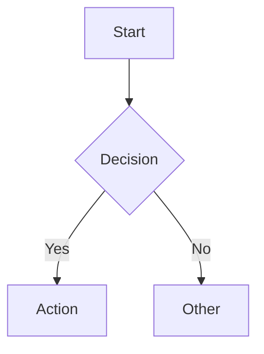

# Mermaid Obsidian Sync Skill

## Description
Enhanced bidirectional sync between Obsidian Canvas and Mermaid diagrams. Includes GitHub-compatible label sanitization, Dataview integration, template insertion, and live preview.

## Capabilities
- **Canvas ↔ Mermaid bidirectional sync**: Convert Canvas nodes/edges ↔ Mermaid flowcharts
- **GitHub-compatible labels**: Auto-sanitize labels on sync (ASCII-only, emoji-free, escape-safe)
- **Dataview integration**: Query diagrams by type, tags, folder, status
- **Template insertion**: Hotkey/snippet insertion with auto-sanitization
- **Live preview server**: Local HTTP server with hot reload, WebSocket updates
- **Export pipeline**: Vault → HTML/PDF with diagrams rendered (pandoc + mermaid-cli)
- **Lint on save**: Auto-validate + auto-sanitize on save
- **Mermaid Live Editor integration**: Open in live editor, import from live editor
- **Dataview blocks**: Live queries embedded in notes

## Canvas ↔ Mermaid Sync

### Canvas → Mermaid
```python
from canvas_sync import CanvasToMermaid

converter = CanvasToMermaid()
mermaid_code = converter.convert(canvas_json)

# Auto-sanitizes for GitHub compatibility
# - Strips emojis
# - Replaces non-ASCII in labels
# - Normalizes escape sequences
# - Sanitizes subgraph labels
```

### Mermaid → Canvas
```python
from canvas_sync import MermaidToCanvas

converter = MermaidToCanvas()
canvas_json = converter.convert(mermaid_code)

# Preserves layout where possible
# Creates Canvas nodes/edges from Mermaid structure
```

## GitHub-Compatible Sync

### Label Sanitization on Sync
```python
from sync import GitHubCompatibleSync

syncer = GitHubCompatibleSync()

# Canvas → Mermaid (auto-sanitizes)
mermaid = syncer.canvas_to_mermaid(canvas_json)

# Mermaid → Canvas (auto-sanitizes)
canvas = syncer.mermaid_to_canvas(mermaid_code)

# Both directions auto-sanitize:
# - Strip emojis
# - Replace non-ASCII (ä→a, ö→o, etc.)
# - Normalize escapes (\n, \t, \r, \\, \", \')
# - Sanitize subgraph labels (ASCII-only)
# - Strip emojis from all labels
```

### Sync Configuration
```python
sync_config = {
    "github_compatible": True,
    "sanitize_labels": True,
    "strip_emojis": True,
    "normalize_escapes": True,
    "subgraph_ascii_only": True,
    "preserve_layout": True,
    "layout_algorithm": "dagre",  # or "elkjs"
}
```

## Dataview Integration

### Live Queries in Notes
```markdown
```dataviewjs
const pages = dv.pages('""');
const diagrams = pages.where(p => p.file.content && p.file.content.includes("```mermaid"));

// Diagram inventory
const byType = {};
for (const page of diagrams) {
    const match = page.file.content.match(/```mermaid\s*(\w+)/);
    const type = match ? match[1] : "unknown";
    byType[type] = (byType[type] || 0) + 1;
}

for (const [type, count] of Object.entries(byType).sort((a,b) => b[1]-a[1])) {
    dv.paragraph(`**${type}**: ${count}`);
}
```
```

### Diagram Inventory Dashboard
```markdown
```dataview
TABLE file.folder as Folder, file.name as Name, type, tags, file.mtime as Modified
FROM ""
WHERE contains(file.content, "```mermaid")
FLATTEN regexmatch(file.content, "```mermaid\s*(\w+)") as type
SORT type
```
```

### Diagram Health Check
```markdown
```dataviewjs
const pages = dv.pages('""').where(p => p.file.content && p.file.content.includes("```mermaid"));
let valid = 0, warnings = 0, invalid = 0;

for (const page of pages) {
    const content = page.file.content;
    const hasType = /```mermaid\s*\w+/.test(content);
    const hasNodes = /\[.*?\]/.test(content);
    const balanced = (content.match(/\[/g)||[]).length === (content.match(/\]/g)||[]).length &&
                     (content.match(/\(/g)||[]).length === (content.match(/\)/g)||[]).length;
    
    if (!hasType) invalid++;
    else if (!hasNodes) warnings++;
    else if (!balanced) invalid++;
    else valid++;
}

dv.table(["Status", "Count"], [
    ["✅ Valid", valid],
    ["⚠️ Warnings", warnings],
    ["❌ Invalid", invalid]
]);
```
```

## Template Insertion

### Snippet Triggers
```markdown
# In Obsidian snippets
---
trigger: "flow"
---


# Type `flow` + Tab → inserts sanitized flowchart template
```

### Auto-Sanitization on Insert
```python
# Snippet insertion auto-sanitizes
snippet_content = get_snippet("flowchart-basic")
sanitized = sanitizer.sanitize(snippet_content)
# Result: GitHub-compatible template
```

## Live Preview Server

```bash
# Start live preview
python preview_server.py --vault /path/to/vault --port 3000

# Features:
# - Hot reload on file change
# - WebSocket updates
# - GitHub-compatible rendering
# - Syntax highlighting
# - Diagram navigation
```

## Export Pipeline

```bash
# Export vault to HTML with rendered diagrams
python export_pipeline.py /path/to/vault ./output --pdf

# Features:
# - Renders all mermaid diagrams
# - GitHub-compatible output
# - Preserves Obsidian links
# - Generates index.html
```

## Files
- `canvas_sync.py` - Canvas ↔ Mermaid converter (with sanitization)
- `sanitizer.py` - GitHub-compatible sanitization
- `preview_server.py` - Live preview with WebSocket
- `export_pipeline.py` - Vault → HTML/PDF export
- `dataview_queries.md` - Dataview query library
- `snippets/` - Sanitized Obsidian snippets
- `hooks/` - Obsidian hooks (lint on save, auto-sanitize)