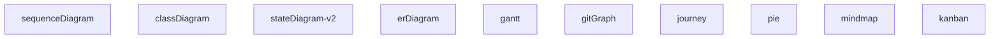

# Mermaid Syntaksi & Grammariikka

## Yleinen rakenne

```mermaid
<diagrammi-tyyppi>
    [konfiguraatio]
    [tyyli/määrittelyt]
    [sisältö]
```

## Peruselementit

### 1. Diagrammin aloitus


### 2. Konfiguraatio (valinnainen)
```mermaid
%%{init: {'theme': 'dark', 'flowchart': {'curve': 'linear'}}}%%
flowchart TD
```

### 3. Suuntaus (flowchart/graph)
```
TD  - Top Down
TB  - Top Bottom (sama kuin TD)
BT  - Bottom Top
RL  - Right Left
LR  - Left Right
```

### 4. Solmut (Nodes)

#### Flowchart
```mermaid
id[teksti]           # suorakulmio
id(teksti)           # pyöristetty
id{teksti}           # rombi (besluit)
id((teksti))         # ympyrä
id>teksti]           # asymmetrinen
id[/teksti/]         # parallelogrammi
id[\teksti\]         # toinen parallelogrammi
id[["teksti"]]       # alikäsittely
id[("teksti")]       # synkronointi
id[/"teksti"/]       # data
```

#### Class Diagram
```mermaid
class nimi {
  +publicField: Type
  -privateField: Type
  #protectedField: Type
  ~packageField: Type
  +publicMethod(): ReturnType
  -privateMethod(): ReturnType
}
```

#### State Diagram
```mermaid
state "nimi" as id
state id {
  [*] --> subState1
  subState1 --> [*]
}
```

### 5. Yhteydet (Edges)

#### Flowchart
```mermaid
A --> B       # perusnuoli
A --- B       # viiva ilman nuolta
A -.-> B      # katkoviiva
A ==> B       # paksu nuoli
A -- teksti --> B  # merkinnällä
A -. teksti .-> B
A == teksti ==> B
```

#### Sequence Diagram
```mermaid
A->>B: viesti      # synkroninen
A-->>B: vastaus    # vastausnuoli
A->>+B: viesti     # aktivoi
A->>-B: viesti     # deaktivoi
A-xB: viesti       # asynkroninen
A--xB: vastaus
```

#### Class Diagram
```mermaid
A <|-- B       # perintä
A *-- B        # kompositi
A o-- B        # agregaatio
A --> B        # assosiaatio
A ..> B        # riippuvuus
A --|> B       # realizaatio
```

### 6. Teemat
```
default, dark, forest, neutral, base
```

### 7. Tyylit (classDef)
```mermaid
classDef luokka fill:#f9f,stroke:#333,stroke-width:2px;
classDef luokka fill:#bbf,stroke:#f66,stroke-width:1px,stroke-dasharray: 5 5;
class nodeId luokka;
```

### 8. Klikkaamattomuus & linkit
```mermaid
click id "https://example.com" "Tooltip"
click id callback "Tooltip"
```

### 9. Kommentit
```mermaid
%% Tämä on kommentti
```

## Validointisäännöt (Generaattoria varten)

### Pakolliset
- [ ] Diagrammin tyyppi määritelty
- [ ] Ainakin yksi solmu
- [ ] Sulut tasapainossa
- [ ] Lainausmerkit oikein (kaksinkertaiset merkkijonot)

### Suositellut
- [ ] ID:t alkavat kirjaimella, sisältävät vain alfanumeerisia + `_`
- [ ] Ei duplicate ID:itä
- [ ] Yhteydet viittaavat olemassa oleviin solmuihin
- [ ] Teema määritelty jos ei default

## Grammariikka (EBNF-tyyli)

```
diagram      = diagramType config? content
diagramType  = "flowchart" | "sequenceDiagram" | "classDiagram" | ...
config       = "%%{init:" json "}%%"
content      = (direction | node | edge | style | click | comment)*

direction    = "TD" | "TB" | "BT" | "RL" | "LR"
node         = nodeId nodeShape? label?
nodeShape    = "[" | "(" | "{" | "((" | ">]" | "[/" | "[\\" | "[[\"" | "[(\"" | "[/\""
edge         = nodeId edgeType nodeId label?
edgeType     = "-->" | "---" | "-.->" | "==>" | "->>" | "-->>" | "->>+" | "->>-" | "-x" | "--x" | "<|--" | "*--" | "o--" | "..>" | "--|>"
label        = "|" text "|" | ":" text
style        = "classDef" className cssProperties
click        = "click" nodeId url? tooltip?
comment      = "%%" text
```

## Seuraavat vaiheet
- [[02-syntaksi/flowchart|Flowchart syntaksi im detail]]
- [[02-syntaksi/sequenceDiagram|Sequence Diagram syntaksi im detail]]
- [[02-syntaksi/classDiagram|Class Diagram syntaksi im detail]]