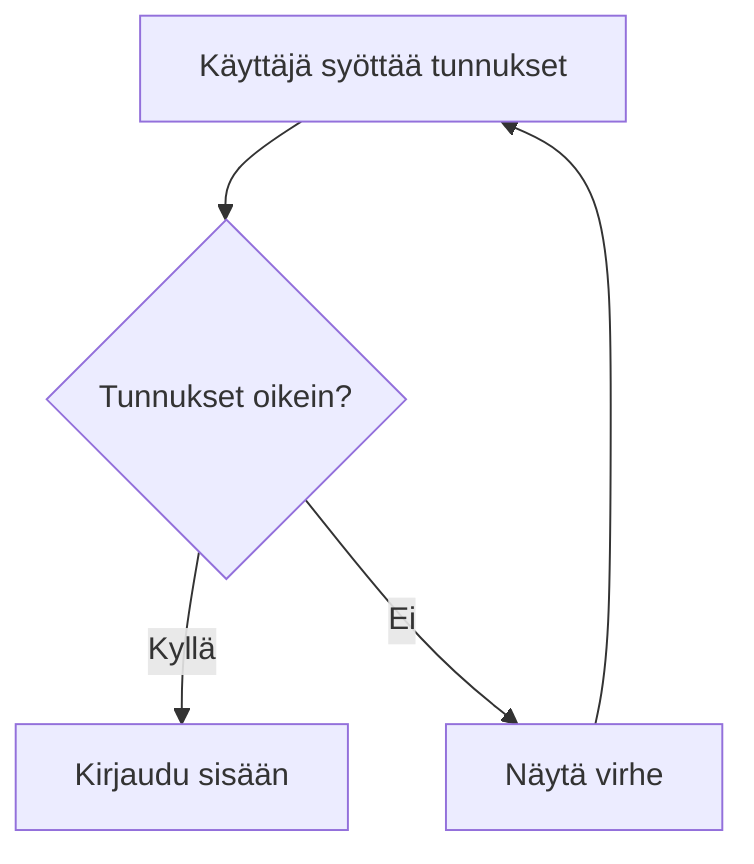

# Testausstrategia

## Testitasot

### 1. Yksikkötestit (Unit)
- Parser: grammariikka → AST
- TemplateEngine: data → Mermaid-source
- Validator: source → ValidationResult
- Optimizer: source → optimized source

### 2. Integraatiotestit
- Pipeline kokonaisuudessaan
- CLI-komennot
- Render-testaus (headless)

### 3. Vastaanotto-testit (Acceptance)
- Golden master -testit: tunnettu syöte → odotettu tuloste
- Visual regression: renderöity kuva vs. baseline

## Testidata

### Kansiota `05-testaus/` rakenne
```
05-testaus/
├── fixtures/           # Syötedata (JSON, luonnollinen kieli, koodi)
│   ├── flowchart/
│   ├── sequenceDiagram/
│   └── ...
├── golden/             # Odotetut tulokset (.mmd-tiedostot)
│   ├── flowchart/
│   └── ...
├── snapshots/          # Visual regression baseline-kuvat
├── schemas/            # Zod/JSON-skeemat validointia varten
└── runners/            # Testiajurit
    ├── render-test.ts  # Mermaid CLI renderöinti
    └── visual-diff.ts  # Pixel-diff
```

### Fixture-esimerkki (flowchart)
```json
{
  "name": "simple-login-flow",
  "description": "Peruskirjautumisvirtaus",
  "input": {
    "type": "natural",
    "content": "Käyttäjä syöttää tunnukset, järjestelmä tarkistaa ne. Jos oikein, kirjautuu sisään. Jos väärin, näytä virhe."
  },
  "expectedDiagramType": "flowchart",
  "expectedNodes": 5,
  "expectedEdges": 4
}
```

### Golden master -esimerkki


## Validointitestit

### Syntaksivirheet (pitää epäonnistua)
- Puuttuva diagrammin tyyppi
- Epätasapainoiset sulut
- Virheelliset solmu-ID:t (eroaa alfanumeerisista)
- Viittaukset olemattomiin solmuihin
- Virheelliset nuolimuotot

### Semanttiset virheet (varoitus, ei estä)
- Yksittäinen solmu ilman yhteyksiä
- Erittäin pitkät polut (layout-ongelmat)
- Suuret solmumäärät ilman ryhmittelyä

## Render-testaus

```typescript
// test/render.test.ts
import { renderToSVG } from '@mermaid-js/mermaid-cli';

async function renderTest(source: string): Promise<RenderResult> {
  try {
    const svg = await renderToSVG(source);
    return { success: true, svg, errors: [] };
  } catch (error) {
    return { success: false, svg: '', errors: [error.message] };
  }
}
```

## CI/CD Pipeline

```yaml
# .github/workflows/test.yml
jobs:
  test:
    runs-on: ubuntu-latest
    steps:
      - uses: actions/checkout@v4
      - uses: actions/setup-node@v4
      - run: npm ci
      - run: npm run test:unit
      - run: npm run test:integration
      - run: npm run test:render
      - run: npm run test:visual
      - uses: actions/upload-artifact@v4
        if: failure()
        with:
          name: failed-renders
          path: test-results/
```

## Kattavuustavoitteet

| Moduuli | Rivikattavuus | Haarakattavuus |
|---------|---------------|----------------|
| Parser | 95% | 90% |
| TemplateEngine | 90% | 85% |
| Validator | 95% | 90% |
| Optimizer | 80% | 75% |
| CLI | 70% | 65% |

## Regression-testaus

Jokainen uusi versio:
1. Aja kaikki golden master -testit
2. Renderöi kaikki golden-tiedostot → vertaa SVG:ää baselineen
3. Jos visual diff > 0.1% → epäonnistuu
4. Uudet fixturet → lisää golden mastereihin manuaalisesti hyväksytään

## Performaanssitestit

- 100 solmua, 200 yhteyttä < 500ms
- 1000 solmua, 5000 yhteyttä < 5s
- Muistin käyttö < 100MB

## Seuraavat vaiheet
- [ ] Vitest-projektin alustus
- [ ] Ensimmäinen fixture: flowchart simple
- [ ] Golden master -runner
- [ ] Render-test runner
- [ ] CI workflow