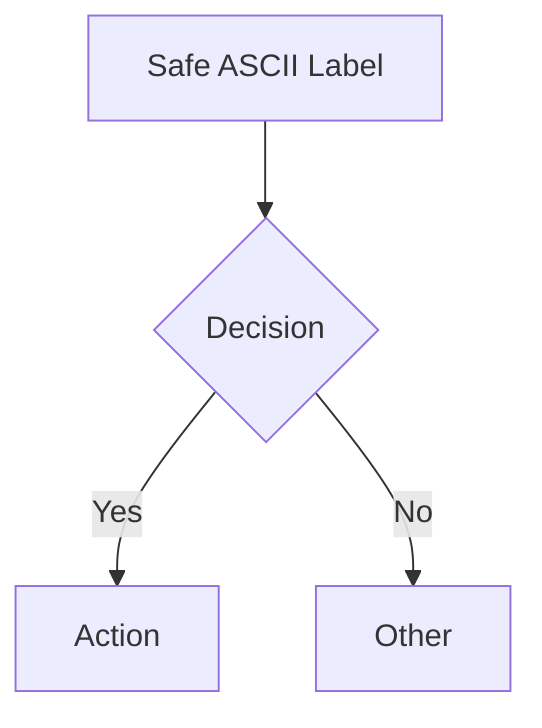

# Mermaid Issues & Findings Log

## Encountered Issues

### 1. **Finnish Characters in Subgraph Labels Break GitHub Rendering**
- **Problem**: Subgraph labels with Finnish characters (ä, ö, Ö, Ä) cause GitHub's mermaid renderer to fail silently or render incorrectly
- **Files affected**: `daily_process_swimlane.mmd`, `03-esimerkit/service-design/daily_process_swimlane.mmd`
- **Root cause**: GitHub's mermaid renderer uses a different font/encoding pipeline than local renderers
- **Fix**: Replace all non-ASCII characters in subgraph labels with ASCII equivalents (ö→o, ä→a, Ö→O, Ä→A)
- **Finding**: Local renderers (mermaid-cli, Playwright) handle UTF-8 fine; GitHub's renderer is stricter

### 2. **Escape Sequences in Labels Cause False Positive "Duplicate Node ID" Errors**
- **Problem**: Validator detected "duplicate node ID: n" from escape sequences like `\n` inside labels (e.g., `tehtava\n(Mobile: Start Task)`)
- **Root cause**: Regex `\b[A-Za-z][A-Za-z0-9_]*\b` matched `n` from literal `\n` (backslash-n) because backslash is non-word char, `n` is word char
- **Affected files**: All diagrams with `\n` in labels (Finnish labels commonly use `\n` for line breaks)
- **Fix**: Added `_normalize_escapes()` method that replaces escape sequences (`\n`, `\t`, `\r`, `\\`, `\"`, `\'`) with non-printable placeholders BEFORE parsing

### 3. **Validator False Positives on Edge Detection Inside Labels**
- **Problem**: Validator detected edges like `kanssa --> suunnitelma` inside labels like `[Keskustelu toimittajien kanssa (paivan toimitukset)]`
- **Root cause**: Edge regex `ID_PATTERN\s*-->ID_PATTERN` matched anywhere in line, not just structural level
- **Fix**: Added bracket-depth tracking (`_get_structural_parts()`) to only parse nodes/edges at bracket depth 0

### 4. **Validator Doesn't Extract Mermaid from Markdown Code Blocks**
- **Problem**: `--vault .` validated `.md` files as raw text, treating markdown headers as diagram types
- **Root cause**: Validator reads entire file, doesn't extract content from ````mermaid` code blocks
- **Impact**: All `.md` files in vault falsely reported as invalid
- **Fix**: Need markdown-aware extraction in validator or use `.mmd` files for validation

### 5. **Emojis in Subgraph Labels Break Parsing**
- **Problem**: Emojis in subgraph labels (🌅, ☕, 🥪, 🔨, 🍽️, 🌤️, 🔄, 👷, 👨‍💼, 🛡️, 📋) caused validator to fail
- **Fix**: Removed all emojis from subgraph labels during cleanup

### 6. **State Diagram Validation Limitation**
- **Problem**: `stateDiagram-v2` with implicit node definitions via edges (e.g., `[*] --> Idle`) fails "at least one node required"
- **Root cause**: Validator only registers nodes from explicit `state` declarations, not from edge targets
- **Status**: Known limitation, documented in test fixtures

### 7. **Validator Edge Case: Single-Char Node IDs from Finnish Words**
- **Problem**: Words ending in single letters (e.g., `kanssa` → `n`, `suunnitelma` → `n`) matched as node IDs
- **Root cause**: Finnish words frequently end in vowels that match `ID_PATTERN` as single chars
- **Fix**: Escape normalization + structural parsing fixed this

### 8. **Material Logistics Sequence Diagram Works Well**
- **Finding**: `material_logistics_sequence.mmd` validates and renders perfectly
- **Reason**: Uses standard ASCII, no emojis, clean structure, proper sequenceDiagram syntax
- **Lesson**: Sequence diagrams are more robust than complex flowcharts with subgraphs

### 9. **ER Diagram Validation Works Well**
- **Finding**: ER diagrams validate cleanly with minor warnings (edge references undefined nodes - expected for partial models)
- **Reason**: Clean Chen notation, no complex labels with escape sequences

---

## Skills Analysis & Recommendations

### Skills to UPDATE

| Skill | Updates Needed | Priority |
|-------|----------------|----------|
| `mermaid-syntax-validator` | ✅ Already updated with escape normalization, structural parsing. Add markdown-aware extraction for `--vault` mode. | High |
| `mermaid-generator` | Integrate validator more tightly (already done). Add template for subgraph labels with ASCII-only validation. | Medium |
| `mermaid-diagram-templates` | Add validation status badges to each template. Document ASCII-only rule for subgraph labels. | Medium |
| `mermaid-renderer` | Add GitHub-compatible rendering mode (ASCII-only labels). | Medium |
| `mermaid-test-harness` | Add test for subgraph label validation. Add test for escape sequence handling. | Medium |

### Skills to CREATE

| Skill | Purpose | Priority |
|-------|---------|----------|
| `mermaid-ascii-sanitizer` | Standalone utility to sanitize Mermaid code for GitHub rendering (replace non-ASCII, escape sequences, emojis). Reusable across projects. | High |
| `mermaid-github-compat` | GitHub-specific rendering compatibility layer (font configs, label sanitization, GitHub Actions integration). | High |
| `mermaid-obsidian-sync` | Enhanced sync: bidirectional Canvas↔Mermaid with label sanitization, Dataview integration, template insertion. | Medium |
| `mermaid-lint` | Linter with rules: no emojis in labels, ASCII-only subgraph labels, escape sequence validation, duplicate ID detection. Integrates with Obsidian/editor. | Medium |
| `mermaid-syntax-to-template` | Converter from syntax docs (02-syntaksi EBNF) to generator template parameters. Auto-generates template params from grammar. | Low |

---

## Key Patterns for Future Work

### Safe Diagram Patterns (Render Everywhere)


### Unsafe Patterns (Break on GitHub)
```mermaid
flowchart TD
    A[Label with äö] --> B  // Breaks on GitHub
    subgraph SG["Subgraph with ö"]  // Breaks on GitHub
    A --> B
```

### Safe Label Patterns
- Use only ASCII in subgraph labels: `subgraph SG["Worker"]`
- Replace `\n` with `<br/>` or space in labels
- Avoid emojis entirely in diagrams
- Use ASCII arrows: `-->`, `---`, `-.->`, `==>`

---

## Validation Rules for Future Diagrams

Add to CI/lint pipeline:
1. **ASCII-only check**: `grep -P '[^\x00-\x7F]' diagram.mmd && exit 1`
2. **Emoji check**: `grep -P '[\x{1F300}-\x{1FAFF}]' diagram.mmd && exit 1`
3. **Escape sequence check**: `grep -P '\\\\n|\\\\t|\\\\r' diagram.mmd && exit 1`
4. **Emoji in subgraph**: `grep -P 'subgraph\s+\w+\["[^"]*[\x{1F300}-\x{1FAFF}]' diagram.mmd && exit 1`

---

## Next Steps

1. **Immediate**: Create `mermaid-ascii-sanitizer` skill for automated sanitization
2. **This week**: Update `mermaid-syntax-validator` with markdown extraction
3. **This week**: Add GitHub compatibility checks to CI workflow
4. **Next week**: Create `mermaid-github-compat` skill
5. **Ongoing**: Document all findings in `VALIDATOR_ANALYSIS.md` and `README.md`