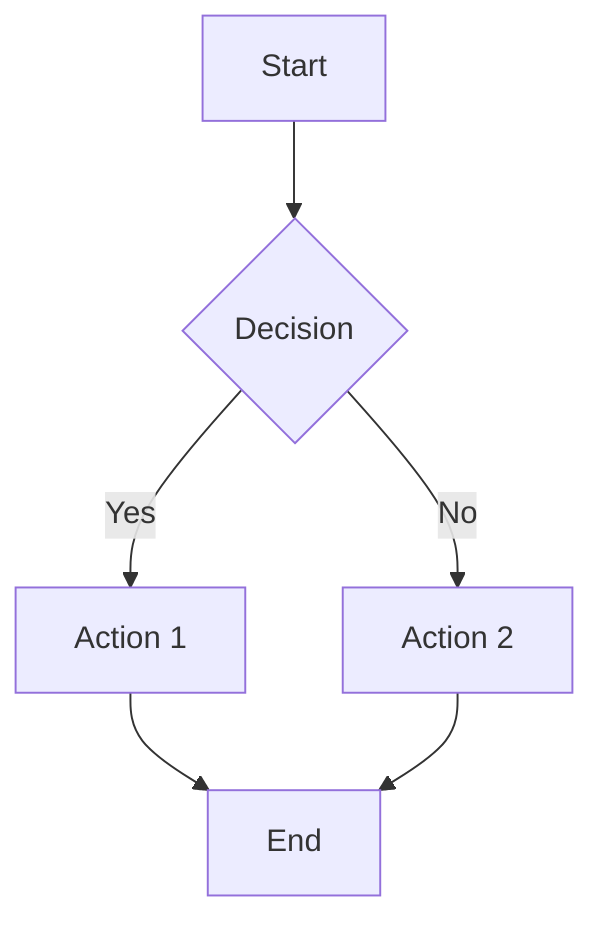

# Mermaid Ultimate Generator - Obsidian Vault

> **Tavoite:** Kehittää ultimaattinen Mermaid-generaattori joka ymmärtää kaikki diagrammityypit, generoi validia syntaksia ja integroituu helposti työkaluihin.

## 🎨 Mermaid Test (GitHub Render)



## 🚀 Quick Start

```bash
# Avaa Obsidianissa
# File → Open vault → Valitse tämä kansio

# Tai VS Code / muu editorilla
code C:/Users/hilve/obsidian-mermaid-ultimate
```

## 📁 Rakenne

```
obsidian-mermaid-ultimate/
├── 00-meta/           # Projektin yleisluonne, roadmap
│   └── index.md       # ← START HERE
├── 01-diagrammit/     # Kaikki 14+ diagrammityyppi syvällisesti
│   └── index.md
├── 02-syntaksi/       # Syntaksisääntöjen, grammariikan dokumentaatio
│   └── index.md
├── 03-esimerkit/      # Kuratoidut, testatut esimerkit
│   ├── index.md
│   └── flowchart/
│       └── basic.md   # Malliesimerkki
├── 04-generaattori/   # Generaattorin arkkitehtuuri, koodi
│   └── arkkitehtuuri.md
├── 05-testaus/        # Testausstrategia, fixturet, golden masters
│   └── strategia.md
└── 99-arkisto/        # Vanhentuneet, referenssimateriaalit
```

## 🎯 Seuraavat askeleet

1. **Lue roadmap** → `00-meta/index.md`
2. **Tutki diagrammityypit** → `01-diagrammit/index.md`
3. **Opettele syntaksi** → `02-syntaksi/index.md`
4. **Käy läpi esimerkit** → `03-esimerkit/index.md`
5. **Suunnittele generaattori** → `04-generaattori/arkkitehtuuri.md`
6. **Määrittele testaus** → `05-testaus/strategia.md`

## 🔗 Hyödylliset linkit

- [Mermaid Live Editor](https://mermaid.live) - Testaa koodia välittömästi
- [Mermaid Docs](https://mermaid.js.org) - Virallinen dokumentaatio
- [Mermaid GitHub](https://github.com/mermaid-js/mermaid) - Lähdekoodi, issuet

## 💡 Obsidian-pluginit (suositellut)

| Plugin | Kuvaus |
|--------|--------|
| Mermaid Tools | Renderöi, vie, muokkaa |
| Dataview | Kyselyt esimerkeistä (`TABLE type FROM "03-esimerkit"`) |
| Canvas | Visuaalinen suunnittelu |
| Git | Versiohallinta vaultille |

## 📝 Muistiinpanot

- Kaikki tiedostot ovat Markdownia (`.md`)
- Linkit: `[[kansio/tiedosto|Näkyvä nimi]]`
- Embeddit: `![[kansio/tiedosto]]`
- Dataview-kyselyt: ````dataview ... ````

---

*Luotu: 2026-09-18*  
*Versio: 0.1.0 (scaffold)*