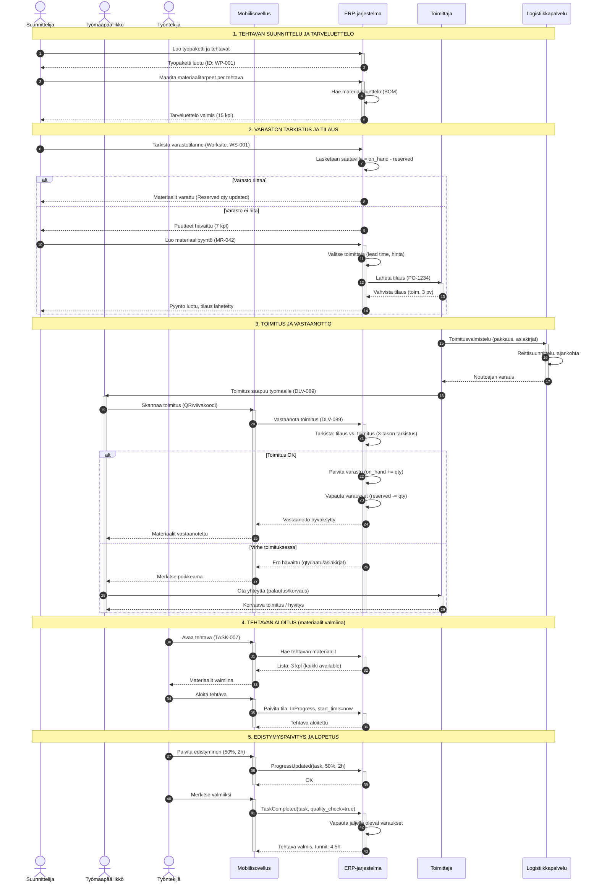

# material_logistics_sequence_pure

```mermaid
sequenceDiagram
    autonumber
    actor Planner as Suunnittelija
    actor SiteManager as Työmaapäällikkö
    actor Worker as Työntekijä
    participant Mobile as Mobiilisovellus
    participant ERP as ERP-jarjestelma
    participant Supplier as Toimittaja
    participant Logistics as Logistiikkapalvelu
    
    Note over Planner,Logistics: 1. TEHTAVAN SUUNNITTELU JA TARVELUETTELO
    
    Planner->>ERP: Luo tyopaketti ja tehtavat
    activate ERP
    ERP-->>Planner: Tyopaketti luotu (ID: WP-001)
    deactivate ERP
    
    Planner->>ERP: Maarita materiaalitarpeet per tehtava
    activate ERP
    ERP->>ERP: Hae materiaaliluettelo (BOM)
    ERP-->>Planner: Tarveluettelo valmis (15 kpl)
    deactivate ERP
    
    Note over Planner,Logistics: 2. VARASTON TARKISTUS JA TILAUS
    
    Planner->>ERP: Tarkista varastotilanne (Worksite: WS-001)
    activate ERP
    ERP->>ERP: Lasketaan saatavilla = on_hand - reserved
    alt Varasto riittaa
        ERP-->>Planner: Materiaalit varattu (Reserved qty updated)
    else Varasto ei riita
        ERP-->>Planner: Puutteet havaittu (7 kpl)
        Planner->>ERP: Luo materiaalipyyntö (MR-042)
        activate ERP
        ERP->>ERP: Valitse toimittaja (lead time, hinta)
        ERP->>Supplier: Laheta tilaus (PO-1234)
        activate Supplier
        Supplier-->>ERP: Vahvista tilaus (toim. 3 pv)
        deactivate Supplier
        ERP-->>Planner: Pyynto luotu, tilaus lahetetty
        deactivate ERP
    end
    
    Note over Planner,Logistics: 3. TOIMITUS JA VASTAANOTTO
    
    Supplier->>Logistics: Toimitusvalmistelu (pakkaus, asiakirjat)
    activate Logistics
    Logistics->>Logistics: Reittisuunnittelu, ajankohta
    Logistics-->>Supplier: Noutoajan varaus
    deactivate Logistics
    
    Supplier->>SiteManager: Toimitus saapuu tyomaalle (DLV-089)
    activate SiteManager
    SiteManager->>Mobile: Skannaa toimitus (QR/viivakoodi)
    activate Mobile
    Mobile->>ERP: Vastaanota toimitus (DLV-089)
    activate ERP
    ERP->>ERP: Tarkista: tilaus vs. toimitus (3-tason tarkistus)
    alt Toimitus OK
        ERP->>ERP: Paivita varasto (on_hand += qty)
        ERP->>ERP: Vapauta varaukset (reserved -= qty)
        ERP-->>Mobile: Vastaanotto hyvaksytty
        Mobile-->>SiteManager: Materiaalit vastaanotettu
    else Virhe toimituksessa
        ERP-->>Mobile: Ero havaittu (qty/laatu/asiakirjat)
        Mobile-->>SiteManager: Merkitse poikkeama
        SiteManager->>Supplier: Ota yhteytta (palautus/korvaus)
        activate Supplier
        Supplier-->>SiteManager: Korvaava toimitus / hyvitys
        deactivate Supplier
    end
    deactivate ERP
    deactivate Mobile
    deactivate SiteManager
    
    Note over Planner,Logistics: 4. TEHTAVAN ALOITUS (materiaalit valmiina)
    
    Worker->>Mobile: Avaa tehtava (TASK-007)
    activate Mobile
    Mobile->>ERP: Hae tehtavan materiaalit
    activate ERP
    ERP-->>Mobile: Lista: 3 kpl (kaikki available)
    deactivate ERP
    Mobile-->>Worker: Materiaalit valmiina
    deactivate Mobile
    
    Worker->>Mobile: Aloita tehtava
    activate Mobile
    Mobile->>ERP: Paivita tila: InProgress, start_time=now
    activate ERP
    ERP-->>Mobile: Tehtava aloitettu
    deactivate ERP
    deactivate Mobile
    
    Note over Planner,Logistics: 5. EDISTYMYSPAIVITYS JA LOPETUS
    
    Worker->>Mobile: Paivita edistyminen (50%, 2h)
    activate Mobile
    Mobile->>ERP: ProgressUpdated(task, 50%, 2h)
    activate ERP
    ERP-->>Mobile: OK
    deactivate ERP
    deactivate Mobile
    
    Worker->>Mobile: Merkitse valmiiksi
    activate Mobile
    Mobile->>ERP: TaskCompleted(task, quality_check=true)
    activate ERP
    ERP->>ERP: Vapauta jaljella olevat varaukset
    ERP-->>Mobile: Tehtava valmis, tunnit: 4.5h
    deactivate ERP
    deactivate Mobile
```